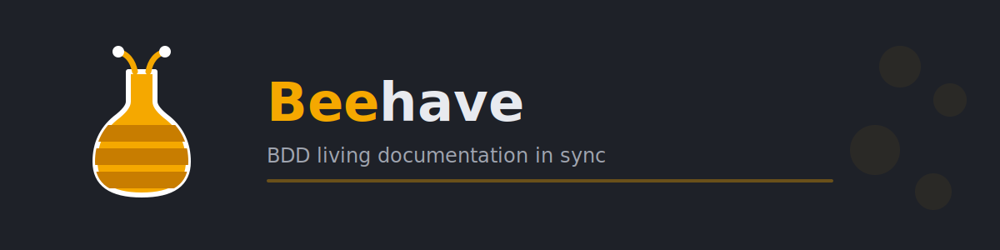

<div align="center">
  

  <br><br>

  <p><strong>A framework-agnostic Python library that keeps your Gherkin acceptance criteria and test stubs in sync.</strong></p>

  [![PyPI][pypi-shield]][pypi-url]
  [![Contributors][contributors-shield]][contributors-url]
  [![Forks][forks-shield]][forks-url]
  [![Stargazers][stars-shield]][stars-url]
  [![Issues][issues-shield]][issues-url]
  [![MIT License][license-shield]][license-url]
  [](https://nullhack.github.io/beehave/coverage/)
  [](https://github.com/nullhack/beehave/actions/workflows/ci.yml)
  [](https://www.python.org/downloads/)
</div>

---

## What it does

Beehave treats your Gherkin `.feature` files as the source of truth and keeps the corresponding test stubs synchronized — safely, idempotently, and without ever touching your test implementation bodies.

- **No stub for a new `Example:`?** `beehave sync` creates one — a typed, skipped test function with the Given/When/Then steps as its docstring.
- **Steps changed in the feature file?** `beehave sync` updates the docstring. Your test body is never touched.
- **`Example:` missing an `@id` tag?** `beehave sync` writes one back into the `.feature` file in-place.
- **`@id` disappeared from the feature file?** `beehave sync` warns you about the orphan. The stub is left untouched — you decide whether to delete it.
- **`@deprecated` tag on a feature or rule?** The framework-native deprecation marker propagates down to every affected test stub.

Beehave is **framework-agnostic**. It ships with a pytest adapter out of the box, and the adapter contract is open for unittest, nose, or any other test runner you prefer.

---

## Why beehave?

BDD frameworks sold a compelling promise: human-readable specifications that live alongside your tests, kept honest by the test suite itself. The promise is real. The implementation is the problem. Every scenario explodes into a constellation of `@given`, `@when`, and `@then` step functions scattered across multiple files, wired together by fragile string matching. Refactor one step and you're hunting across the codebase. Add a new scenario and you're registering glue code. The ceremony grows with every feature, and the spec drifts from reality anyway — silently in unused step definitions, loudly in broken ones, always painfully.

Plain pytest, on the other hand, is refreshingly direct. But there's no business-readable layer: acceptance criteria live in tickets or comments, never in code, and nothing machine-enforces that what the stakeholder approved is what the test exercises.

Beehave is the middle ground. Write your acceptance criteria in plain Gherkin — business-readable, version-controlled, owned by the team. Run `beehave sync` and the worker-bee work is done: generating test stubs, keeping docstrings in sync with your steps, assigning stable IDs, and flagging drift before it silently rots. You implement the test body however you like, in plain pytest or unittest, with no step files and no glue. The hive stays in order automatically — that tedious, thankless, essential synchronisation work is handled so you never have to think about it again.

---

## Installation

Available on [PyPI](https://pypi.org/project/beehave/):

```bash
pip install beehave
```

With pytest support (recommended):

```bash
pip install "beehave[pytest]"
```

No `conftest.py` changes required. Beehave is invoked on-demand via CLI.

---

## Quick start

**1. Bootstrap your project:**

```bash
beehave nest
```

This creates the canonical directory structure:

```
docs/features/
  backlog/
  in-progress/
  completed/
tests/features/
```

And injects a `[tool.beehave]` section into `pyproject.toml` if absent.

**2. Write a feature file with an untagged `Example:`:**

```gherkin
# docs/features/in-progress/checkout.feature
Feature: Checkout

  Rule: Tax calculation

    Example: VAT is applied at the correct rate
      Given a cart with items totalling £100
      When the buyer is in the UK
      Then the order total is £120
```

**3. Run sync:**

```bash
beehave sync
```

**4. Two things just happened automatically:**

The feature file was updated with a stable ID:

```gherkin
    @id:a3f2b1c4
    Example: VAT is applied at the correct rate
```

And a test stub was created at `tests/features/checkout/tax_calculation_test.py`:

```python
import pytest

@pytest.mark.skip(reason="not yet implemented")
def test_checkout_a3f2b1c4() -> None:
    """
    Given: a cart with items totalling £100
    When: the buyer is in the UK
    Then: the order total is £120
    """
    ...
```

**5. Implement the test and ship.**

The stub is already in the right place with the right name. Fill in the body and remove the `skip`.

---

## See it in 2 minutes

No feature files yet? Generate a working example project in one command:

```bash
$ beehave hatch

[beehave] HATCH backlog/forager-journey.feature
[beehave] HATCH in-progress/waggle-dance.feature
[beehave] HATCH completed/winter-preparation.feature
[beehave] hatch complete
```

Three bee-themed `.feature` files land under `docs/features/`, covering every Gherkin construct beehave supports: `Background`, `Rule`, `Example`, `Scenario Outline` with an `Examples` table, data tables, untagged scenarios (to trigger auto-ID), and `@deprecated`.

Now run sync:

```bash
$ beehave sync

[beehave] CREATE tests/features/forager_journey/forager_readiness_test.py
[beehave] CREATE tests/features/forager_journey/nectar_quality_control_test.py
[beehave] CREATE tests/features/waggle_dance/direction_encoding_test.py
[beehave] CREATE tests/features/waggle_dance/distance_encoding_test.py
```

The untagged `Example:` in `forager-journey.feature` got an `@id` written back in-place. Every stub is already in the right file with the right name.

Remove the `skip`, implement the test body, run `beehave sync` again. The hive stays in sync from here on automatically.

---

## Commands

| Command | What it does |
|---|---|
| `beehave nest` | Bootstrap canonical directory structure and config |
| `beehave hatch` | Generate bee-themed demo `.feature` files |
| `beehave sync` | Scan `.feature` files and reconcile test stubs (create, update, warn) |
| `beehave status` | Dry-run preview of what `sync` would do; exits 0 if in sync, 1 if pending |
| `beehave version` | Show version and installed adapters |

All commands support `--verbose` and `--json` for human and machine-readable output. `beehave sync` supports `--framework <name>` to target a specific adapter.

---

## How it works

```
beehave sync invoked
  ├─ Read config    — load [tool.beehave] from pyproject.toml
  ├─ Assign IDs     — write @id tags to untagged Examples
  └─ Sync stubs
       ├─ Create stubs for new Examples
       ├─ Update docstrings when steps change
       ├─ Rename functions when the feature slug changes
       ├─ Warn about orphan tests (criterion deleted from feature file)
       ├─ Move non-conforming tests to canonical locations
       └─ Propagate @deprecated markers from Gherkin tags
```

Sync is **on-demand only** — there is no auto-trigger, watch mode, or pytest hook. You run it when you want.

---

## File layout

Beehave expects — and `nest` will create — this structure:

```
docs/features/
  backlog/          ← criteria waiting to be built
  in-progress/      ← criteria actively being implemented
  completed/        ← shipped criteria

tests/features/
  <feature-name>/
    <rule-slug>_test.py   ← one file per Rule: block
```

Feature files may also live at `docs/features/<name>.feature` (root level, no subfolder). All four locations map identically to `tests/features/<feature-name>/`.

Every test function name encodes its criterion:

```
test_<feature_slug>_<@id>
```

---

## Markers

Beehave manages markers through the adapter template. With the pytest adapter:

| Marker | Meaning |
|---|---|
| `skip(reason="not yet implemented")` | Stub created, not yet implemented |
| `deprecated` | Criterion retired via `@deprecated` Gherkin tag |

Your own markers (`slow`, `unit`, `integration`) are never touched.

---

## Configuration

```toml
# pyproject.toml
[tool.beehave]
features_path = "docs/features"   # default; omit if this matches your layout
framework = "pytest"              # default; "unittest" planned for v2
template_path = "my_templates"    # optional: custom template folder
```

CLI flags override config values:

```bash
beehave sync --framework pytest --features-dir specs
```

---

## CI behaviour

`beehave status` is designed for CI gates:

```bash
beehave status --json
```

- Exit `0` if everything is in sync
- Exit `1` if changes are pending

Use it in GitHub Actions, pre-commit hooks, or any pipeline that needs to enforce that `.feature` files and test stubs are aligned.

On a read-only filesystem, `beehave sync` skips all write operations and instead **fails the run** if it finds any `Example:` without an `@id` tag. This enforces that IDs are always committed — drift is caught at the PR gate, not after merge.

---

## Requirements

| | Version |
|---|---|
| Python | ≥ 3.13 |
| gherkin-official | ≥ 39.0.0 |

Optional extras:

```bash
pip install "beehave[pytest]"    # pytest adapter support
```

---

## Contributing

```bash
git clone https://github.com/nullhack/beehave
cd behave
uv sync --all-extras
uv run task test && uv run task lint && uv run task static-check
```

Bug reports and pull requests are welcome on [GitHub](https://github.com/nullhack/beehave/issues).

---

## Relationship to pytest-beehave

`pytest-beehave` is a separate pytest plugin (future release) that wraps `beehave` under the hood and adds pytest-specific conveniences: automatic sync on every test run, HTML acceptance-criteria columns in `pytest-html` reports, and terminal step printing. If you use `pytest-beehave`, you do not need to invoke `beehave sync` manually — the plugin does it for you via pytest hooks.

Beehave itself is completely independent of pytest. It is a standalone library with a CLI and Python API.

---

## License

MIT — see [LICENSE](LICENSE).

**Author:** eol ([@nullhack](https://github.com/nullhack)) · [Documentation](https://nullhack.github.io/beehave)

<!-- MARKDOWN LINKS & IMAGES -->
[pypi-shield]: https://img.shields.io/pypi/v/beehave?style=for-the-badge&color=orange
[pypi-url]: https://pypi.org/project/beehave/
[contributors-shield]: https://img.shields.io/github/contributors/nullhack/beehave.svg?style=for-the-badge
[contributors-url]: https://github.com/nullhack/beehave/graphs/contributors
[forks-shield]: https://img.shields.io/github/forks/nullhack/beehave.svg?style=for-the-badge
[forks-url]: https://github.com/nullhack/beehave/network/members
[stars-shield]: https://img.shields.io/github/stars/nullhack/beehave.svg?style=for-the-badge
[stars-url]: https://github.com/nullhack/beehave/stargazers
[issues-shield]: https://img.shields.io/github/issues/nullhack/beehave.svg?style=for-the-badge
[issues-url]: https://github.com/nullhack/beehave/issues
[license-shield]: https://img.shields.io/badge/license-MIT-green?style=for-the-badge
[license-url]: https://github.com/nullhack/beehave/blob/main/LICENSE
