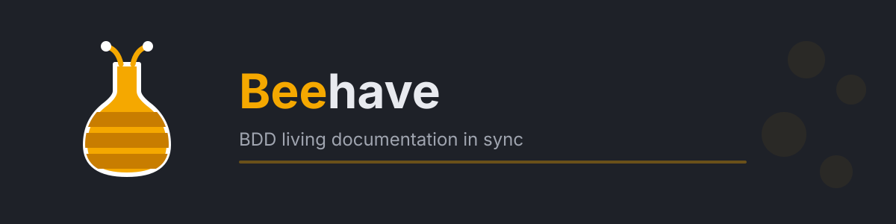

<div align="center">



[](https://www.python.org/downloads/)
[](LICENSE)

**BDD without step definitions. The `.feature` is the sole source of truth.**

</div>

---

**beehave** is a thinner alternative to **behave** and **pytest-bdd**. Instead
of authoring step definitions that match Gherkin step text to Python functions
via `@given`/`@when`/`@then` decorators, beehave links each `Scenario` to a
test function by **function name** alone, generates a `pytest`-native skeleton
(`@pytest.mark.parametrize` rows + `with step(...)` blocks), and statically
verifies that the consumer's `.py` matches the `.feature` contract 1-1.

## Install

beehave is not yet on PyPI. Install from source:

```bash
git clone https://github.com/nullhack/beehave
cd beehave
uv sync
```

Requires Python ≥ 3.14.

## Quick start

### 1. Write a feature

```gherkin
# docs/features/hive_activity.feature
Feature: Hive Activity

  Background:
    Given the hive is active

  Scenario Outline: honey production from nectar
    Given the hive has <nectar> grams of nectar
    And the evaporation rate is <rate> percent
    When the bees fan their wings for <hours> hours
    Then the hive produces <honey> grams of honey

    Examples:
      | nectar | rate | hours | honey |
      | 100    | 20   | 8     | 80    |
      | 200    | 25   | 12    | 150   |

  Rule: Hive defense
    Scenario: guard bee inspects visitor
      Given a visitor bee with <scent> colony odor
      When the guard inspects the visitor
      Then the visitor is <outcome>
```

### 2. Generate the test skeleton

```bash
beehave generate
```

```
tests/features/
├── hive_activity_default_test.py       # top-level scenarios (the outline)
└── hive_activity_hive_defense_test.py  # Rule: Hive defense
```

```python
# tests/features/hive_activity_default_test.py
from beehave import step
import pytest


@pytest.mark.parametrize(
    ('nectar', 'rate', 'hours', 'honey'),
    [
        ('100', '20', '8', '80'),
        ('200', '25', '12', '150'),
    ],
)
def test_honey_production_from_nectar(nectar: str, rate: str, hours: str, honey: str) -> None:
    with step('Given', 'the hive is active'):
        pass
    with step('Given', 'the hive has <nectar> grams of nectar', nectar=nectar):
        pass
    with step('And', 'the evaporation rate is <rate> percent', rate=rate):
        pass
    with step('When', 'the bees fan their wings for <hours> hours', hours=hours):
        pass
    with step('Then', 'the hive produces <honey> grams of honey', honey=honey):
        pass
```

The skeleton is emitted **only when the `.py` is absent**. Re-running
`generate` never clobbers consumer bodies (idempotent).

### 3. Fill in the bodies

Replace the `pass` inside each `with step(...)` block with real code.
The `Then` block is where the outcome assertion lives.

```python
def test_honey_production_from_nectar(nectar: str, rate: str, hours: str, honey: str) -> None:
    with step('Given', 'the hive is active'):
        activate_hive()
    with step('Given', 'the hive has <nectar> grams of nectar', nectar=nectar):
        store_nectar(int(nectar))
    with step('And', 'the evaporation rate is <rate> percent', rate=rate):
        set_evaporation(int(rate))
    with step('When', 'the bees fan their wings for <hours> hours', hours=hours):
        fan_wings(int(hours))
    with step('Then', 'the hive produces <honey> grams of honey', honey=honey):
        assert hive_honey() == int(honey)
```

### 4. Check + run

```bash
beehave check          # verify .py ↔ .feature 1-1 contract
pytest                 # run the tests (the step CM attributes failures)
```

## Two enforcement modes

| Mode | What `beehave check` verifies | Runtime step verification |
|---|---|---|
| **A — signature-only** | `.py` non-private function signatures match feature-derived signatures exactly (1-1) | None. Bodies are free-form. |
| **B — step-enforced** | Same as A. | `with step(...)` blocks verify `(keyword, text, placeholder-name-set)` at position N against the feature scenario. Failures attribute via `add_note`. |

The generated skeleton imports `step` already; Mode B activates the moment
the consumer keeps the `with step(...)` blocks. Removing the import + blocks
downgrades to Mode A (signature-only).

## CLI reference

| Command | Purpose |
|---|---|
| `beehave generate` | Emit `*_test.py` skeletons into `tests/features/` (only if absent). |
| `beehave check` | Full sweep: every feature's signatures vs. `.py` 1-1 + orphan-module detection. |
| `beehave check <path>...` | Scoped: only the named `.feature` paths. Skips orphan detection. |
| `beehave status` | Print `.feature` count + emitted `*_test.py` count. Exit 2 if `docs/features/` missing. |

`beehave check` exits non-zero on any contract violation (missing function,
extra non-private function, signature drift, orphan module on full sweep).
Private functions (leading `_`) are exempt — consumer helpers, fixtures, etc.

For incremental workflows, scope the check to changed features:

```bash
beehave check $(git diff --name-only HEAD~1 HEAD -- 'docs/features/*.feature')
```

## How the `.feature` maps onto the `.py`

- **Scenario title → function name:** `Honey Production From Nectar` → `test_honey_production_from_nectar` (lowered, whitespace collapsed). Globally unique across all features.
- **Rule → module:** Top-level scenarios go to `<feature_slug>_default_test.py`. Scenarios inside a Rule go to `<feature_slug>_<rule_slug>_test.py`.
- **Background:** Feature Background prepended to every scenario's step list. Rule Background prepended only to that Rule's scenarios. Background steps may not contain `<placeholders>`.
- **Examples → `@pytest.mark.parametrize`:** All params typed `str`. Row cells are string tuples. Examples-table tags emit `pytest.param(..., marks=pytest.mark.<tag>)` only when tags differ across tables.
- **Tags:** `@tag` on Feature or Rule → module-level `pytestmark = [pytest.mark.<tag>, ...]`. `@tag` on Scenario → `@pytest.mark.<tag>` decorator.
- **Step docstrings + data tables:** Parsed (Full Gherkin) and surfaced as body-local variables (`docstring = '...'`, `data_table = [{'col': 'val'}, ...]`) inside the `with step(...)` block. Not passed to the `step()` call.

## Title rules (enforced at parse time)

- **Charset:** Unicode letters, digits, and spaces only (no hyphens, punctuation, or symbols).
- **Word count:** 2–6 words.
- **Uniqueness:** Case-insensitive, across Feature / Rule / Scenario titles, keyed on the slug (whitespace-collapsed, lowercased).

Violations raise at `parse_feature` time and prevent generation.

## License

MIT — see [LICENSE](LICENSE).
