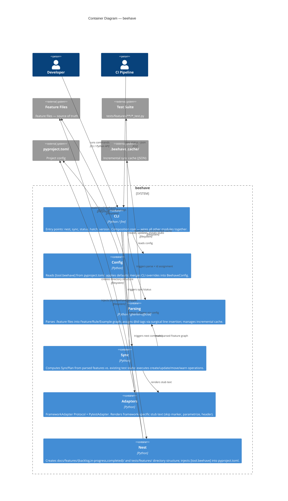

# C4 — Container Diagram

> Last updated: 2026-04-22
> Source: docs/adr/ADR-2026-04-22-module-structure.md, docs/domain-model.md

```mermaid
C4Container
  title Container Diagram — beehave

  Person(developer, "Developer", "")
  Person(ci, "CI Pipeline", "")

  System_Boundary(beehave_sys, "beehave") {
    Container(cli, "CLI", "Python / fire", "Entry points: nest, sync, status, hatch, version. Composition root — wires all other modules together.")
    Container(config, "Config", "Python", "Reads [tool.beehave] from pyproject.toml; applies defaults; merges CLI overrides into BeehaveConfig.")
    Container(parsing, "Parsing", "Python / gherkin-official", "Parses .feature files into Feature/Rule/Example graph; assigns @id tags via surgical line insertion; manages incremental cache.")
    Container(sync, "Sync", "Python", "Computes SyncPlan from parsed features vs. existing test stubs; executes create/update/move/warn operations.")
    Container(adapters, "Adapters", "Python", "FrameworkAdapter Protocol + PytestAdapter. Renders framework-specific stub text (skip marker, parametrize, header).")
    Container(nest, "Nest", "Python", "Creates docs/features/{backlog,in-progress,completed}/ and tests/features/ directory structure; injects [tool.beehave] into pyproject.toml.")
  }

  System_Ext(feature_files, "Feature Files", ".feature files — source of truth")
  System_Ext(test_suite, "Test Suite", "tests/features/**/*_test.py")
  System_Ext(pyproject, "pyproject.toml", "Project config")
  System_Ext(cache_store, ".beehave_cache/", "Incremental sync cache (JSON)")

  Rel(developer, cli, "runs commands", "CLI / Python API")
  Rel(ci, cli, "runs status --json", "CLI")

  Rel(cli, config, "reads config")
  Rel(cli, parsing, "triggers parse + id assignment")
  Rel(cli, sync, "triggers sync/status")
  Rel(cli, nest, "triggers nest command")
  Rel(cli, adapters, "selects adapter via config")

  Rel(config, pyproject, "reads [tool.beehave]", "filesystem")
  Rel(nest, feature_files, "creates directory structure", "filesystem")
  Rel(nest, pyproject, "injects [tool.beehave] snippet", "filesystem")
  Rel(parsing, feature_files, "reads + writes @id tags", "filesystem")
  Rel(parsing, cache_store, "reads/writes incremental cache", "filesystem")
  Rel(sync, test_suite, "creates, updates, moves stubs", "filesystem")
  Rel(sync, parsing, "reads parsed Feature graph")
  Rel(sync, adapters, "renders stub text")
```
