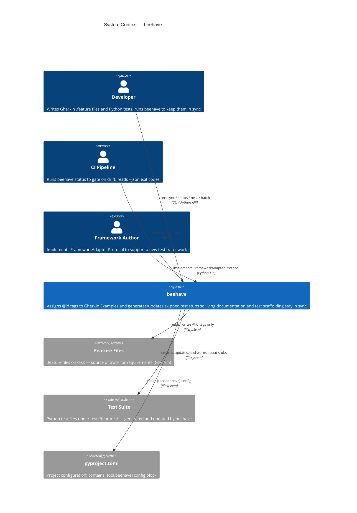

# C4 — System Context

> Last updated: 2026-04-22
> Source: docs/domain-model.md, docs/system.md, docs/arch_journal.md

```mermaid
C4Context
  title System Context — beehave

  Person(developer, "Developer", "Writes Gherkin .feature files and Python tests; runs beehave to keep them in sync")
  Person(ci, "CI Pipeline", "Runs beehave status to gate on drift; reads --json exit codes")
  Person(framework_author, "Framework Author", "Implements FrameworkAdapter Protocol to support a new test framework")

  System(beehave, "beehave", "Assigns @id tags to Gherkin Examples and generates/updates skipped test stubs so living documentation and test scaffolding stay in sync")

  System_Ext(feature_files, "Feature Files", ".feature files on disk — source of truth for requirements (Gherkin)")
  System_Ext(test_suite, "Test Suite", "Python test files under tests/features/ — generated and updated by beehave")
  System_Ext(pyproject, "pyproject.toml", "Project configuration; contains [tool.beehave] config block")

  Rel(developer, beehave, "runs sync / status / nest / hatch", "CLI / Python API")
  Rel(ci, beehave, "runs status --json", "CLI")
  Rel(framework_author, beehave, "implements FrameworkAdapter Protocol", "Python API")
  Rel(beehave, feature_files, "reads; writes @id tags only", "filesystem")
  Rel(beehave, test_suite, "creates, updates, and warns about stubs", "filesystem")
  Rel(beehave, pyproject, "reads [tool.beehave] config", "filesystem")
```
