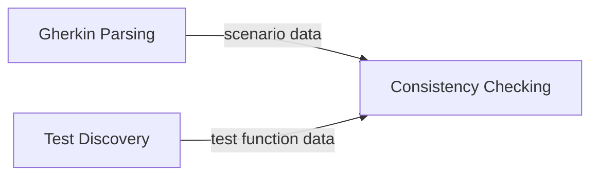

# Domain Model: beehave

> Current understanding of the business domain.
> Updated by the Domain Expert when domain understanding evolves.
> This document captures what code cannot express: WHY entities exist, HOW aggregates are bounded, and WHAT business capabilities each context serves.
>
> **Evolving document:** Domain Modeling formalizes understanding into the sections below. The Bounded Contexts, Events and Commands, Entities, Relationships, Aggregate Boundaries, and Context Map sections are the canonical structural spec.

---

## Summary

beehave is a CLI tool that bridges Gherkin `.feature` files and Python test files. It parses feature files into structured scenario data, generates Hypothesis-based test stubs, checks consistency between feature files and existing test code using AST analysis, and cleans up unmapped test functions. The domain is a single pipeline: parse Gherkin → compare against test code → generate/check/clean. There is no runtime coupling between generated tests and beehave itself — tests import only Hypothesis.

---

## Bounded Contexts

| Context | Responsibility | Key Entities | Business Capability | Why Separate | Integration Points |
|---------|----------------|--------------|---------------------|-------------|-------------------|
| `Gherkin Parsing` | Parse `.feature` files, extract scenarios, steps, placeholders, literals, merge backgrounds | `Feature`, `Scenario`, `ScenarioOutline`, `Step`, `Placeholder`, `Literal`, `Background`, `ExamplesTable`, `Rule` | Transform Gherkin text into structured domain objects | Distinct input format with its own parsing rules, title validation, and background merging logic | Produces structured scenario data consumed by downstream contexts |
| `Test Discovery` | AST-parse Python test files, extract function names, decorators, body nodes, module-level strategies | `TestFunction`, `ModuleStrategy` | Represent existing test code as comparable domain objects | Different input format (Python AST) with its own extraction rules | Produces test function data consumed by consistency checking |
| `Consistency Checking` | Compare parsed Gherkin against discovered tests, enforce body rules, detect unmapped, generate stubs, clean unmapped | `Stub`, `Unmapped`, `ConsistencyReport` | Ensure feature files and test files stay in sync | Pure coordination logic that depends on both upstream contexts but owns the reconciliation semantics | Consumes data from Gherkin Parsing and Test Discovery |

---

## Events and Commands

### Domain Events

| Event | Bounded Context | Description | Trigger Command |
|-------|-----------------|-------------|-----------------|
| `StubsGenerated` | `Consistency Checking` | New test stub files created for scenarios without matching test functions | `generate` |
| `ConsistencyChecked` | `Consistency Checking` | Full consistency report produced: body enforcement violations, example bijection failures, unmapped listed | `check` |
| `UnmappedCleaned` | `Consistency Checking` | Unmapped test functions removed from test files | `clean` |
| `FeatureParsed` | `Gherkin Parsing` | A `.feature` file successfully parsed into structured domain objects | Internal |
| `TestFileDiscovered` | `Test Discovery` | A Python test file successfully AST-parsed into test function data | Internal |

### Commands

| Command | Bounded Context | Actor | Read Model | Produces Event(s) | Rejection Event |
|---------|-----------------|-------|------------|---------------------|-------------------|
| `generate` | `Consistency Checking` | CLI user (developer) | Parsed features + discovered test functions | `StubsGenerated` | None (best-effort generation) |
| `check` | `Consistency Checking` | CLI user (developer) | Parsed features + discovered test functions | `ConsistencyChecked` | None |
| `clean` | `Consistency Checking` | CLI user (developer) | Discovered test functions + parsed scenario names | `UnmappedCleaned` | None |

---

## Entities

| Name | Type | Description | Bounded Context | Aggregate Root? |
|------|------|-------------|-----------------|-----------------|
| `Feature` | Entity | A parsed `.feature` file containing scenarios, rules, and an optional background. Identified by globally-unique title. | `Gherkin Parsing` | Yes |
| `Rule` | Entity | A named group of scenarios within a feature. Title unique within parent feature. | `Gherkin Parsing` | No |
| `Scenario` | Entity | A single test case with ordered steps. Maps 1:1 to a test function via deterministic name derivation. | `Gherkin Parsing` | No |
| `ScenarioOutline` | Entity | A parameterized scenario with an examples table. Generates `@example()` decorated test functions. | `Gherkin Parsing` | No |
| `Step` | Value Object | A single Given/When/Then line containing optional placeholders and literals. | `Gherkin Parsing` | — |
| `Placeholder` | Value Object | A `<name>` token in step text that becomes a Hypothesis `@given()` parameter. | `Gherkin Parsing` | — |
| `Literal` | Value Object | A numeric digit sequence or double-quoted string extracted from step text, enforced as an AST `Constant` node. | `Gherkin Parsing` | — |
| `Background` | Entity | Shared steps merged transparently into every scenario in the feature. No placeholders allowed. Both numeric and quoted-string literals enforced by default; configurable via `background_check_numeric` and `background_check_string` in pyproject.toml. | `Gherkin Parsing` | No |
| `ExamplesTable` | Value Object | A table of parameter values for a Scenario Outline, with optional type inference. | `Gherkin Parsing` | — |
| `TestFunction` | Entity | A Python function discovered via AST parsing. Identified by its derived function name. | `Test Discovery` | No |
| `ModuleStrategy` | Value Object | A module-level variable defining a Hypothesis strategy for a placeholder name. | `Test Discovery` | — |
| `Stub` | Value Object | A generated test function with `...` body. Exempt from body enforcement. | `Consistency Checking` | — |
| `Unmapped` | Value Object | A test function with no matching scenario, or a scenario with no matching test function. | `Consistency Checking` | — |

---

## Relationships

| Subject | Relation | Object | Cardinality | Notes |
|---------|----------|--------|-------------|-------|
| `Feature` | contains | `Rule` | 0:N | Rules group scenarios within a feature |
| `Feature` | contains | `Scenario` | 1:N | Scenarios directly under the feature (outside any Rule) |
| `Feature` | contains | `Background` | 0:1 | At most one background per feature |
| `Rule` | contains | `Scenario` | 1:N | Scenarios grouped under a rule |
| `Rule` | contains | `ScenarioOutline` | 0:N | Outlines can appear under rules |
| `Feature` | contains | `ScenarioOutline` | 0:N | Outlines directly under the feature |
| `Scenario` | has | `Step` | 1:N | Ordered sequence of steps |
| `Scenario` | maps to | `TestFunction` | 1:1 | Via deterministic name derivation |
| `ScenarioOutline` | maps to | `TestFunction` | 1:1 | One function with N `@example()` decorators, one per Examples table row |
| `Step` | contains | `Placeholder` | 0:N | `<name>` tokens in step text |
| `Step` | contains | `Literal` | 0:N | Numeric digits or double-quoted strings |
| `Background` | merged into | `Scenario` | N:M | Background steps prepended to every scenario in scope |
| `ExamplesTable` | provides values for | `Placeholder` | N:1 | Each column header is a placeholder name |
| `Placeholder` | resolved by | `ModuleStrategy` | 0:1 | Module-level strategy variable takes priority |

---

## Aggregate Boundaries

| Aggregate | Root Entity | Invariants | Why Grouped | Bounded Context |
|-----------|-------------|------------|-------------|-----------------|
| `Feature` | `Feature` | Feature titles globally unique. Scenario titles globally unique across all features. All titles: Unicode letters, digits, spaces only. Background has no placeholders. Rule titles unique within parent feature. | A feature file is the unit of parsing and the basis for directory structure. Everything inside belongs to one file and shares one background scope. | `Gherkin Parsing` |
| `TestFile` | `TestFile` (implied) | Function name is the sole lookup key. No @id tags, no cache. | A test file is the unit of AST discovery. All functions and strategies within it share the same module scope. | `Test Discovery` |

---

## Context Map

The three contexts form a linear pipeline with no bidirectional relationships.

| Upstream Context | Downstream Context | Relationship Pattern | Translation / Anti-Corruption Layer |
|-----------------|-------------------|---------------------|-------------------------------------|
| `Gherkin Parsing` | `Consistency Checking` | Conformist | Structured scenario data flows directly; no translation needed |
| `Test Discovery` | `Consistency Checking` | Conformist | Test function data flows directly; no translation needed |

### Context Map Diagram

### Anti-Corruption Layers

No anti-corruption layers needed. All contexts are internal to beehave with no external system integration.

---

## Changes

| Date | Source | Change | Reason |
|------|--------|--------|--------|
| 2026-05-13 | v3 spec discovery | Initial domain model created | Bootstrap from v3 specification |
