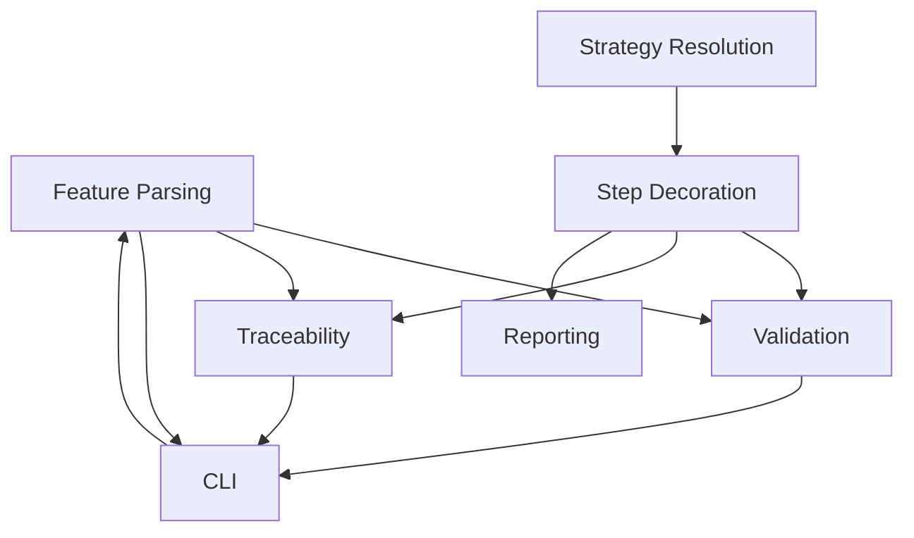

# Domain Model: beehave

> Current understanding of the business domain.
> Updated by the Domain Expert when domain understanding evolves.
> This document captures what code cannot express: WHY entities exist, HOW aggregates are bounded, and WHAT business capabilities each context serves.
>
> **Evolving document:** Domain Modeling formalizes understanding into the sections below. The Bounded Contexts, Events and Commands, Entities, Relationships, Aggregate Boundaries, and Context Map sections are the canonical structural spec.

---

## Summary

beehave is a thin Python layer that adds Gherkin-style step decorators (@Given, @When, @Then, @And, @But) to Hypothesis-based tests, with vocabulary validation at pytest collection time and traceability linking test functions to .feature scenarios via @id tags. It provides a Gherkin parser that maps Scenario Outline + Examples to Hypothesis @example + @given, enforces vocabulary consistency at collection time, and renders stakeholder-readable failure reports from Hypothesis counterexamples. The core library is runner-agnostic (depends only on Hypothesis), with pytest integration provided as an optional plugin.

---

## Bounded Contexts

| Context | Responsibility | Key Entities | Business Capability | Why Separate | Integration Points |
|---------|----------------|--------------|---------------------|-------------|-------------------|
| Step Decoration | Attach metadata and apply Hypothesis @given at import time | StepDecorator, ExampleDecorator, BackgroundDecorator | Annotate test functions with Gherkin structure and resolve strategies | Step decoration is a pure metadata concern; strategy resolution is a separate concern | Provides __beehave_steps__ metadata to Validation and Reporting |
| Strategy Resolution | Map <placeholder> names to Hypothesis strategies | StrategyVariable, TypeInference | Generate Hypothesis strategies from module-level variables and @Example values | Strategy resolution happens at import time; it's a separate concern from step text validation | Receives placeholder names from Step Decoration, provides strategies to @Given |
| Feature Parsing | Parse .feature files and extract scenarios, steps, placeholders | FeatureFile, Scenario, Step, Placeholder, ExamplesTable | Parse Gherkin syntax into structured data for validation and traceability | Gherkin parsing is a separate concern from test execution; .feature files are the source of truth | Provides scenario data to Validation and CLI commands |
| Validation | Validate step text, ordering, placeholders, and @id links against .feature files | ValidationReport, Mismatch, Orphan | Enforce vocabulary consistency and structural correctness at collection time | Validation reads from both Feature Parsing and Step Decoration; it's a cross-cutting concern | Reads from Feature Parsing and Step Decoration, reports via CLI and (future) pytest plugin |
| Traceability | Link test functions to .feature scenarios via @id tags | IdTag, OrphanTest, OrphanScenario | Ensure every .feature scenario has a corresponding test and vice versa | Traceability is a distinct concern from validation; @id linking is its own bounded context | Reads @id tags from Step Decoration and Feature Parsing |
| CLI | Manage .feature files, test stubs, and synchronization | SyncCommand, GenerateCommand, FixCommand, CleanCommand | Provide developer workflow commands for managing the .feature ↔ test relationship | CLI commands modify files; they're a separate concern from runtime test execution | Reads and writes Feature Parsing data and Python test files |
| Reporting | Render Gherkin-readable failure reports from Hypothesis counterexamples | StepReport, FailureReport | Make Hypothesis counterexamples understandable by stakeholders | Reporting is triggered on failure; it's separate from the happy-path test execution | Receives step metadata and counterexample values from Step Decoration |

---

## Events and Commands

### Domain Events

| Event | Bounded Context | Description | Trigger Command |
|-------|-----------------|-------------|-----------------|
| StepDecorated | Step Decoration | A test function was annotated with a step decorator | DecorateFunction |
| StrategyResolved | Strategy Resolution | A <placeholder> was mapped to a Hypothesis strategy | ResolveStrategy |
| FeatureFileParsed | Feature Parsing | A .feature file was successfully parsed | ParseFeatureFile |
| ValidationError | Validation | A mismatch was found between step text and .feature content | ValidateSteps |
| OrphanDetected | Traceability | A test or scenario has no matching counterpart | CheckTraceability |
| IdAssigned | Traceability | An @id tag was generated and written into a .feature file | SyncIds |
| StubGenerated | CLI | A test stub was created for an orphan scenario | GenerateStub |
| FixApplied | CLI | Decorator text was corrected to match .feature content | FixMismatch |
| OrphanRemoved | CLI | An orphan test function was deleted | CleanOrphans |
| TestFailed | Reporting | A beehave-decorated test failed, triggering failure report rendering | ReportFailure |

### Commands

| Command | Bounded Context | Actor | Read Model | Produces Event(s) | Rejection Event |
|---------|-----------------|-------|------------|---------------------|-----------------|
| DecorateFunction | Step Decoration | Developer (via import) | Module-level variables | StepDecorated | None |
| ResolveStrategy | Strategy Resolution | @Given decorator (at import time) | Module scope, @Example values | StrategyResolved | None (falls back to st.integers()) |
| ParseFeatureFile | Feature Parsing | CLI command or (future) pytest plugin | .feature file content | FeatureFileParsed | None (parse errors surface as validation errors) |
| ValidateSteps | Validation | CLI command or (future) pytest plugin | Step metadata + .feature scenario data | ValidationError | None |
| CheckTraceability | Traceability | CLI command or (future) pytest plugin | @id tags in both test and .feature | OrphanDetected | None |
| SyncIds | CLI | Developer (via `beehave sync`) | .feature files | IdAssigned | None |
| GenerateStub | CLI | Developer (via `beehave generate`) | .feature scenarios + @id tags | StubGenerated | None |
| FixMismatch | CLI | Developer (via `beehave fix`) | .feature scenarios + test decorators | FixApplied | None |
| CleanOrphans | CLI | Developer (via `beehave clean`) | Orphan test functions | OrphanRemoved | None |
| ReportFailure | Reporting | Hypothesis callback | Step metadata + counterexample values | TestFailed | None |

---

## Entities

| Name | Type | Description | Bounded Context | Aggregate Root? |
|------|------|-------------|-----------------|-----------------|
| StepDecorator | Entity | A @Given/@When/@Then/@And/@But annotation on a test function | Step Decoration | No |
| ExampleDecorator | Entity | An @Example annotation providing explicit test values | Step Decoration | No |
| BackgroundDecorator | Entity | An @Background annotation referencing a shared setup fixture | Step Decoration | No |
| StrategyVariable | Value Object | A module-level variable mapping a placeholder name to a Hypothesis strategy | Strategy Resolution | — |
| TypeInference | Value Object | Strategy inference from @Example value types (int → st.integers(), str → st.text(), bool → st.booleans()) | Strategy Resolution | — |
| FeatureFile | Entity | A parsed .feature file containing Feature, Rule, Scenario, and Steps | Feature Parsing | Yes |
| Rule | Value Object | A Gherkin Rule block that groups scenarios within a FeatureFile; normalized to snake_case for test module naming (e.g. "Total calculation" → total_calculation_test.py) | Feature Parsing | — |
| TestModule | Value Object | A Python test file derived from a FeatureFile + Rule mapping; path follows tests/features/<feature_slug>/<rule_name>_test.py (or default_test.py when no Rule exists) | Feature Parsing | — |
| TestDirectory | Value Object | A directory under tests/features/ named after the feature slug, containing one or more TestModules; one directory per FeatureFile (1:1) | Feature Parsing | — |
| Scenario | Entity | A Gherkin scenario with @id tag, steps, and optional Examples table | Feature Parsing | No |
| Step | Value Object | A Gherkin step with keyword (Given/When/Then/And/But), text, and placeholders. @And/@But inherit their effective step type from the preceding Given/When/Then keyword for ordering validation | Feature Parsing | — |
| AdoptionLevel | Value Object | A progressive opt-in level (1: decorators only, 2: add .feature traceability) determining which validations are active | Validation | — |
| Placeholder | Value Object | A <placeholder> token in step text that maps to a strategy | Feature Parsing | — |
| ExamplesTable | Value Object | A table of explicit test values from the .feature file | Feature Parsing | — |
| IdTag | Value Object | An @id:<value> tag linking a scenario to a test function; value is a random 8-character ID, generated once by beehave sync and permanent | Traceability | — |
| ValidationReport | Entity | A report of mismatches, orphans, and ordering violations | Validation | No |
| Mismatch | Value Object | A difference between decorator step text and .feature step text, carrying the expected text and actual text for reporting | Validation | — |
| OrphanTest | Value Object | A test function with no matching .feature scenario | Traceability | — |
| OrphanScenario | Value Object | A .feature scenario with no matching test function | Traceability | — |
| StepReport | Value Object | A rendered step with ✓/✗/(not reached) and placeholder values | Reporting | — |
| FailureReport | Entity | A Gherkin-readable failure scenario rendered from a Hypothesis counterexample | Reporting | Yes |

---

## Relationships

| Subject | Relation | Object | Cardinality | Notes |
|---------|----------|--------|-------------|-------|
| StepDecorator | has | Placeholder | 1:N | Each step text may contain multiple <placeholder> tokens |
| Scenario | has | Step | 1:N | A scenario contains one or more steps in order |
| Scenario | has | IdTag | 1:1 | Every scenario has exactly one @id tag (auto-generated if missing) |
| Scenario | has | ExamplesTable | 1:1 | Every scenario has an ExamplesTable (unified parameterization; a simple scenario has a single-row table) |
| FeatureFile | has | Scenario | 1:N | A feature file contains one or more scenarios |
| FeatureFile | has | Rule | 0:N | A feature file may contain Rule blocks that group scenarios |
| FeatureFile | maps to | TestDirectory | 1:1 | Each feature file has exactly one corresponding test directory |
| Rule | maps to | TestModule | 1:1 | Each Rule produces one test module; no-Rule features produce default_test.py |
| TestDirectory | contains | TestModule | 1:N | A test directory contains one or more test modules |
| FeatureFile | has | Background | 0:1 | Optional shared Given steps |
| TestFunction | has | StepDecorator | 1:N | A test function has one or more step decorators |
| TestFunction | has | ExampleDecorator | 0:N | Optional explicit test values |
| TestFunction | references | BackgroundDecorator | 0:1 | Optional shared setup fixture |
| IdTag | links | Scenario | 1:1 | The @id tag in .feature matches the @id suffix in the test function name |
| StepDecorator | resolved by | StrategyVariable | 0:1 | Placeholder names resolved from module scope |
| StepDecorator | resolved by | TypeInference | 0:1 | Fallback: strategy inferred from @Example value types |
| FailureReport | composed of | StepReport | 1:N | Each step in the scenario gets a report line |
| ValidationReport | gated by | AdoptionLevel | 1:1 | The adoption level determines which validations are active |
| StepDecorator | has effective keyword | Step | 1:1 | @And/@But decorators inherit their effective keyword from the preceding Given/When/Then |

---

## Aggregate Boundaries

| Aggregate | Root Entity | Invariants | Why Grouped | Bounded Context |
|-----------|-------------|------------|-------------|----------------|
| TestFunction | TestFunction (Python function) | All <placeholder> names must appear as function parameters; step ordering must be Given → When → Then; @Example values must match placeholder count | A test function is the unit of composition for Gherkin + Hypothesis | Step Decoration |
| FeatureScenario | Scenario | Every scenario must have exactly one @id (random, permanent, owned by beehave); step text must be consistent between .feature and test; every scenario has an ExamplesTable (unified parameterization) | A scenario is the atomic unit of traceability between .feature and test | Feature Parsing |
| FailureReport | FailureReport | At most one step can fail (✗); subsequent steps are "(not reached)"; assertion failures always attributed to @Then or @But; non-assertion exceptions attributed to @Given/@When/@Then by body line order | A failure report is the atomic unit of stakeholder-readable output | Reporting |

---

## Context Map

| Upstream Context | Downstream Context | Relationship Pattern | Translation / Anti-Corruption Layer |
|-----------------|-------------------|---------------------|-------------------------------------|
| Feature Parsing | Validation | Customer-Supplier | Validation reads parsed scenarios; Feature Parsing provides structured data |
| Step Decoration | Validation | Customer-Supplier | Validation reads step metadata; Step Decoration provides __beehave_steps__ |
| Feature Parsing | CLI | Customer-Supplier | CLI commands read and write .feature files |
| Step Decoration | Reporting | Customer-Supplier | Reporting reads step metadata for failure rendering |
| Validation | CLI | Customer-Supplier | CLI commands use validation results to report mismatches and orphans |
| Strategy Resolution | Step Decoration | Partnership | @Given resolves strategies at import time, tightly coupled to step decorator execution order |

### Context Map Diagram

### Anti-Corruption Layers

| ACL | Protects Context | From Context | Translation Rules |
|-----|-----------------|--------------|-------------------|
| HypothesisBridge | Step Decoration, Strategy Resolution, Reporting | Hypothesis library | Translates between beehave's step/placeholder model and Hypothesis's @given/@example/@settings model. @Given applies @given at import time. @Example converts to hypothesis.example(). |

---

## Changes

| Date | Source | Change | Reason |
|------|--------|--------|--------|
| 2026-05-10 | IN_20260510_design | Initial domain model | Core product design decisions |
| 2026-05-10 | IN_20260510_architecture | Added Strategy Resolution context | Import-time @given application via @Given decorator |
| 2026-05-10 | IN_20260510_integration | Added Reporting context with Hypothesis callback | Failure reporting uses Hypothesis report_example, not pytest hooks |