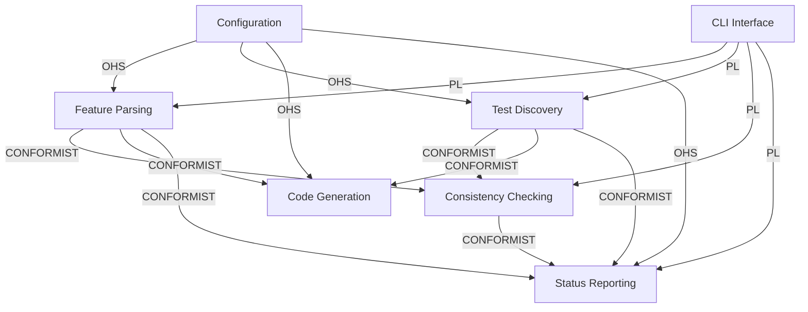

# Domain Specification: beehave

## Context Map

### Context Relationships

| Upstream Context | Downstream Context | Relationship Pattern | Translation Notes |
|-----------------|-------------------|---------------------|-------------------|
| Feature Parsing | Consistency Checking | CONFORMIST | ScenarioInfo consumed as-is |
| Feature Parsing | Code Generation | CONFORMIST | ScenarioInfo consumed as-is |
| Feature Parsing | Status Reporting | CONFORMIST | ScenarioInfo and EmptyRuleInfo consumed as-is |
| Test Discovery | Consistency Checking | CONFORMIST | TestInfo consumed as-is |
| Test Discovery | Code Generation | CONFORMIST | TestInfo consumed as-is |
| Test Discovery | Status Reporting | CONFORMIST | TestInfo consumed as-is |
| Consistency Checking | Status Reporting | CONFORMIST | Violation tuples consumed as-is |
| Configuration | Feature Parsing | OHS | Config provides directories, background_check flags |
| Configuration | Test Discovery | OHS | Config provides directory paths only |
| Configuration | Code Generation | OHS | Config provides default_strategy mapping |
| Configuration | Status Reporting | OHS | Config provides directory paths |
| CLI | Feature Parsing | PL | CLI dispatches to parse_feature and detect_empty_rules via cmd_* handlers |
| CLI | Test Discovery | PL | CLI dispatches via cmd_* handlers |
| CLI | Consistency Checking | PL | CLI dispatches via cmd_* handlers |
| CLI | Status Reporting | PL | CLI dispatches via cmd_status handler |

### Context Map Diagram



### Anti-Corruption Layers

| ACL | Protects Context | From Context | ADR Reference |
|-----|-----------------|--------------|---------------|
| — | — | — | No external systems |

---

## Feature Parsing

### Context

Parses Gherkin `.feature` files into structured domain objects. This context owns the canonical representation of a feature: its title, path, background steps, rules, scenarios, placeholders, literals, and examples tables. All downstream contexts consume ScenarioInfo without modification.

In addition to full parsing, this context provides a lightweight `detect_empty_rules()` function that inspects the Gherkin AST for Rule nodes with zero Scenario children — enabling Status Reporting to distinguish "no scenarios" from "needs scenarios" without a full parse.

### Entities

| Name | Type | Purpose | Aggregate Root? |
|------|------|---------|-----------------|
| ScenarioInfo | Entity | Represents a parsed Gherkin scenario with all extracted metadata (steps, placeholders, literals, examples table) | Yes |
| ParsedStep | Value Object | A single Given/When/Then step with extracted keywords, placeholders, and literals | — |
| Placeholder | Value Object | A `<name>` token extracted from step text | — |
| Literal | Value Object | A numeric or quoted-string token extracted from step text | — |
| ExamplesTable | Value Object | The Examples data table from a Scenario Outline | — |
| EmptyRuleInfo | Value Object | Result of lightweight AST inspection: whether a feature has Rules with zero Scenario children, and which ones | — |

### Relationships

| Subject | Relation | Object | Cardinality | Notes |
|---------|----------|--------|-------------|-------|
| ScenarioInfo | contains | ParsedStep | 1:N | Merged feature background + rule background + scenario steps |
| ScenarioInfo | contains | Placeholder | 1:N | Deduplicated across all merged steps |
| ScenarioInfo | contains | Literal | 1:N | From scenario steps always; from backgrounds only if config enables |
| ScenarioInfo | references | ExamplesTable | 0:1 | Only for Scenario Outlines |
| Feature | contains | ScenarioInfo | 1:N | Feature file aggregates all scenarios |

### Aggregate Boundaries

| Aggregate | Root Entity | Why Grouped | See |
|-----------|-------------|-------------|-----|
| Feature | ScenarioInfo | Feature file is the consistency unit — parsing, generation, checking, and status all operate per-feature | ### Invariants |

### Data Shapes

#### ScenarioInfo

| Field | Type | Required | Constraints |
|-------|------|----------|-------------|
| title | str | Yes | Non-empty, letters/digits/spaces only |
| function_name | str | Yes | Derived: `test_` + title lowercased with underscores |
| steps | tuple[ParsedStep] | Yes | Merged bg + rule bg + scenario steps |
| placeholders | tuple[Placeholder] | Yes | Deduplicated |
| literals | tuple[Literal] | Yes | Not deduplicated |
| examples | ExamplesTable \| None | No | Present only for Scenario Outlines |
| is_outline | bool | Yes | True if Scenario Outline |
| feature_title | str | Yes | Feature-level title |
| feature_path | str | Yes | Slug derived from feature title |
| rule_path | str | Yes | "default_test" or "<rule_slug>_test" |
| line | int | Yes | Line number in .feature file |

#### TestInfo

| Field | Type | Required | Constraints |
|-------|------|----------|-------------|
| function_name | str | Yes | Must match ScenarioInfo.function_name for mapping |
| given_kwargs | tuple[str] | Yes | Parameters from @given() decorator |
| example_rows | tuple[dict[str,object]] | Yes | Row dicts from @example() decorators |
| body_name_nodes | tuple[str] | Yes | All ast.Name identifiers in body (sorted) |
| body_constant_nodes | tuple[object] | Yes | All ast.Constant values in body (sorted) |
| is_stub | bool | Yes | True if body is only `pass` or `...` |
| line | int | Yes | Line number in test file |

#### Violation

| Field | Type | Required | Constraints |
|-------|------|----------|-------------|
| path | str | Yes | File path where violation occurred |
| line | int | Yes | Line number (0 = unknown) |
| error_type | str | Yes | One of: unmapped-scenario, unmapped-test, missing-placeholder, missing-literal, example-mismatch, misplaced-test, invalid-feature-title, invalid-rule-title, invalid-scenario-title, duplicate-feature-title, duplicate-rule-title, duplicate-scenario-title |
| message | str | Yes | Human-readable description |
| is_warning | bool | Yes | Only misplaced-test is a warning |

#### EmptyRuleInfo

| Field | Type | Required | Constraints |
|-------|------|----------|-------------|
| has_empty_rules | bool | Yes | True if any Rule node has zero Scenario children |
| rule_titles | tuple[str] | Yes | Titles of Rule nodes with zero Scenario children, in file order; empty if none |

### Integration Points

#### Technology Requirements

| Context | Requirement | Verification |
|---------|-------------|-------------|
| Feature Parsing | gherkin-official library for AST parsing | grep import gherkin_official |
| Feature Parsing | Regular expressions for token extraction | grep re.compile |
| Feature Parsing | Python keyword/builtin validation | grep keyword.iskeyword |
| Feature Parsing | Title validation across all .feature files | grep validate_all_titles |

#### Feature Parsing -> Consistency Checking

- Purpose: Provide parsed scenarios for violation detection
- Trigger: CLI invokes check command
- Mechanism: Direct function call (parse_feature returns dict[str, ScenarioInfo])
- Pattern: CONFORMIST
- Payload: {function_name: ScenarioInfo}
- Response: None (Consistency Checking consumes and produces Violations independently)
- Error handling: GherkinError raised on parse failure, caught by caller
- Ownership: Feature Parsing context

#### Feature Parsing -> Status Reporting

- Purpose: Provide parsed scenarios for stage computation, and empty-rule detection for disambiguation
- Trigger: CLI invokes status command
- Mechanism: Direct function calls (parse_feature returns dict[str, ScenarioInfo]; detect_empty_rules returns EmptyRuleInfo)
- Pattern: CONFORMIST
- Payload: {function_name: ScenarioInfo} plus EmptyRuleInfo
- Response: None
- Error handling: GherkinError caught (parse_feature), feature marked as broken stage; GherkinError from detect_empty_rules caught, feature treated as "no scenarios"
- Ownership: Feature Parsing context

#### Feature Parsing -> Title Validation

- Purpose: Validate all .feature file titles for charset, word count, and global uniqueness
- Trigger: CLI invokes check (check_all) or generate command
- Mechanism: Direct function call (validate_all_titles returns list[Violation])
- Pattern: CONFORMIST
- Payload: list[Violation] with error_type in {invalid-feature-title, invalid-rule-title, invalid-scenario-title, duplicate-feature-title, duplicate-rule-title, duplicate-scenario-title}
- Response: Empty list if all titles valid
- Error handling: GherkinError from any .feature file caught by caller
- Ownership: Feature Parsing context

### External Contracts

#### Contract: parse_feature(feature_path, config, seen_function_names=None) -> dict[str, ScenarioInfo]

- **Actor**: CLI or downstream context (Consistency Checking, Code Generation, Status Reporting)
- **Trigger**: Feature needs to be parsed from disk
- **Input**: {feature_path: Path, config: Config, seen_function_names: set[str] | None}
- **Output**: {function_name: ScenarioInfo} dict keyed by derived test function name
- **Errors**:
  - Gherkin syntax error -> GherkinError
  - Empty feature file -> GherkinError ("No feature found")
  - Invalid feature title -> GherkinError
  - Duplicate function name (if seen_function_names provided) -> GherkinError
  - Background with placeholders -> GherkinError
  - Invalid scenario title -> GherkinError
- **Side Effects**: Reads .feature file from disk
- **Preconditions**: Feature file exists at given path, is valid Gherkin

#### Contract: _extract_placeholders(text: str) -> tuple[Placeholder, ...]

- **Actor**: Feature Parsing (called by _parse_step during parse_feature)
- **Trigger**: A Gherkin step text needs placeholder extraction
- **Input**: {text: str} — the text of a single Gherkin step
- **Output**: tuple of Placeholder value objects
- **Rules**:
  1. A `<token>` in step text is a Placeholder iff `token` is a valid Python identifier, not a Python keyword, not a Python builtin
  2. Placeholder regex matches regardless of surrounding quotes (e.g., `"<name>"` extracts `<name>` as Placeholder)
  3. Duplicate placeholders within a step are deduplicated

#### Contract: _extract_literals(text: str) -> tuple[Literal, ...]

- **Actor**: Feature Parsing (called by _parse_step during parse_feature)
- **Trigger**: A Gherkin step text needs literal extraction
- **Input**: {text: str} — the text of a single Gherkin step
- **Output**: tuple of Literal value objects
- **Rules**:
  1. **Numeric literals**: A bare token matching `^-?\d+(\.\d+)?$` is a numeric Literal. Integer tokens (matching `^-?\d+$`) are stored as `Literal(value=int(token))`. Float tokens with a decimal point (matching `^-?\d+\.\d+$`) are stored as `Literal(value=float(token))`. Leading zeros (e.g., `007`) produce `int("007")` → `7`; downstream `str(7)` → `"7"`, which does NOT match a body `Constant("007")` (string `"007"`).
  2. **String literals**: A quoted segment (`"..."` or `'...'`) is a string Literal with content extracted as-is between quotes. Both double and single quote styles are supported — `'<name>'` is handled identically to `"<name>"`. Exception: `<...>` inside quotes is skipped regardless of quote style (already captured as Placeholder). `[...]` inside quotes is captured verbatim. Empty quoted strings (`""` or `''`) produce `Literal(value="")` — the zero-length string is extracted and matches body `Constant("")` via `str("")` normalization.
  3. String literals are NOT deduplicated (each occurrence is a separate literal).

### Invariants

- `_extract_placeholders` never produces a Placeholder for `<token>` where token is inside quotes AND token is a valid placeholder — the placeholder Regex matches regardless of quotes
- `_extract_literals` never produces a Literal for `<...>` content found inside quoted strings
- `_extract_literals` captures `[...]` inside quotes verbatim (e.g., `"[PHONE]"` → `Literal(value="[PHONE]")`)
- Placeholder extraction and literal extraction can run on the same step text without interference

#### Contract: detect_empty_rules(feature_path) -> EmptyRuleInfo

- **Actor**: Status Reporting
- **Trigger**: `parse_feature()` returned an empty dict `{}` and Status Reporting needs to determine whether the feature has no scenarios at all or has Rules with zero Scenario children
- **Input**: {feature_path: Path}
- **Output**: EmptyRuleInfo with `has_empty_rules: bool` and `rule_titles: tuple[str]`
- **Errors**:
  - Gherkin syntax error -> GherkinError (caught by Status Reporting, feature treated as "no scenarios")
  - File not found -> GherkinError
- **Side Effects**: Reads .feature file from disk (lightweight AST traversal — no ScenarioInfo extraction)
- **Preconditions**: Feature file exists at given path

#### Contract: validate_all_titles(config) -> list[Violation]

- **Actor**: Consistency Checking (check_all), Code Generation (generate_stubs pre-flight)
- **Trigger**: All .feature file titles in the project must be validated for charset, word count, and uniqueness
- **Input**: {config: Config}
- **Output**: list of Violation objects for invalid or duplicate titles; empty list if all titles valid
- **Errors**:
  - Gherkin syntax error in any .feature file -> GherkinError (caught by caller, feature treated as broken)
- **Side Effects**: Reads all .feature files from disk (lightweight AST traversal — extracts only titles, no ScenarioInfo)
- **Preconditions**: Config is loaded, features_dir exists
- **Validation Rules**:
  - Charset: Feature/Rule/Scenario titles must match `[\w\s]+`
  - Word Count: 2–6 words on title text only (after stripping Gherkin keyword prefix)
  - Uniqueness: Case-insensitive global comparison across all Feature, Rule, and Scenario titles
- **Violation Types Produced**:
  - invalid-feature-title: Feature title fails charset or word count
  - invalid-rule-title: Rule title fails charset or word count
  - invalid-scenario-title: Scenario/Scenario Outline title fails charset or word count
  - duplicate-feature-title: Feature title matches another Feature title (case-insensitive)
  - duplicate-rule-title: Rule title matches another Rule or any Feature/Scenario title
  - duplicate-scenario-title: Scenario title matches another Scenario or any Feature/Rule title

### State Machines

Not applicable — Feature Parsing has no internal state.

### Error Handling

| Scenario | Response |
|----------|----------|
| Invalid Gherkin syntax | GherkinError raised with line number and message |
| Feature with no scenarios or rules | `parse_feature()` returns empty dict `{}`; `detect_empty_rules()` returns `EmptyRuleInfo(has_empty_rules=False, rule_titles=())` |
| Rule with no scenarios | `parse_feature()` produces no ScenarioInfo entries; `detect_empty_rules()` returns `EmptyRuleInfo(has_empty_rules=True, rule_titles=("Rule title", ...))` |
| GherkinError from detect_empty_rules | Caught by Status Reporting; feature treated as "no scenarios" (conservative fallback) |
| Feature title invalid (charset) | GherkinError raised by parse_feature; invalid-feature-title Violation by validate_all_titles |
| Feature title invalid (word count) | validate_all_titles returns invalid-feature-title Violation |
| Rule title invalid (charset) | GherkinError raised by parse_feature; invalid-rule-title Violation by validate_all_titles |
| Rule title invalid (word count) | validate_all_titles returns invalid-rule-title Violation |
| Scenario title invalid (charset) | GherkinError raised by parse_feature; invalid-scenario-title Violation by validate_all_titles |
| Scenario title invalid (word count) | validate_all_titles returns invalid-scenario-title Violation |
| Duplicate Feature title | validate_all_titles returns duplicate-feature-title Violation with file paths |
| Duplicate Rule title | validate_all_titles returns duplicate-rule-title Violation |
| Duplicate Scenario title | validate_all_titles returns duplicate-scenario-title Violation |
| Title text extraction ambiguous | validate_all_titles strips Gherkin keyword prefix (Feature:/Rule:/Scenario:/Scenario Outline:) before validation; colons in title text are part of the title |

### Invariants

- Every scenario produces exactly one ScenarioInfo
- Function names must be valid Python identifiers
- Function names must not be Python keywords or builtins
- Feature title derivation is deterministic (title slug = lowercase, words joined by underscore)
- Background steps are merged transparently into every scenario's step list
- `detect_empty_rules()` makes a single Gherkin AST pass — it does not extract ScenarioInfo or parse step contents
- `validate_all_titles()` makes a single pass over all .feature files, extracting only titles (Feature, Rule, Scenario) — no ScenarioInfo extraction
- All title validation is case-insensitive for uniqueness comparison
- Title word count validation strips the Gherkin keyword prefix before counting — `Feature: Hive Activity` counts 2 words on `Hive Activity`
- `_extract_placeholders` never produces a Placeholder for `<token>` where token is inside quotes AND token is a valid placeholder — the placeholder Regex matches regardless of quotes
- `_extract_literals` never produces a Literal for `<...>` content found inside quoted strings
- `_extract_literals` captures `[...]` inside quotes verbatim (e.g., `"[PHONE]"` → `Literal(value="[PHONE]")`)
- Placeholder extraction and literal extraction can run on the same step text without interference

---

## Test Discovery

### Context

Discovers and analyzes Python test files via AST parsing. Extracts test function metadata (decorator arguments, body AST nodes, stub status) to enable consistency checking and code generation. Owns the canonical representation of a test function's structure.

### Entities

| Name | Type | Purpose | Aggregate Root? |
|------|------|---------|-----------------|
| TestInfo | Entity | Represents a discovered test function with all extracted metadata | Yes |

### Relationships

| Subject | Relation | Object | Cardinality | Notes |
|---------|----------|--------|-------------|-------|
| TestInfo | contains | given_kwargs | 1:N | From @given() decorator |
| TestInfo | contains | example_rows | 0:N | From @example() decorators |
| TestInfo | contains | body_name_nodes | 0:N | ast.Name ids in function body |
| TestInfo | contains | body_constant_nodes | 0:N | ast.Constant values in function body |
| TestFile | contains | TestInfo | 1:N | One file can contain multiple test functions |

### Aggregate Boundaries

| Aggregate | Root Entity | Why Grouped | See |
|-----------|-------------|-------------|-----|
| TestFile | TestInfo | Test file is the unit of discovery — all test functions in a file are discovered together | ### Invariants |

### Integration Points

#### Technology Requirements

| Context | Requirement | Verification |
|---------|-------------|-------------|
| Test Discovery | Python AST module for parsing | grep import ast |
| Test Discovery | Hypothesis decorator introspection | grep @given |

#### Test Discovery -> Consistency Checking

- Purpose: Provide discovered test functions for violation detection
- Trigger: CLI invokes check command
- Mechanism: Direct function call (discover_tests returns dict[str, TestInfo])
- Pattern: CONFORMIST
- Payload: {function_name: TestInfo}
- Response: None
- Error handling: SyntaxError caught, file treated as containing zero tests
- Ownership: Test Discovery context

#### Test Discovery -> Status Reporting

- Purpose: Provide discovered test functions for stage computation
- Trigger: CLI invokes status command
- Mechanism: Direct function call (discover_tests returns dict[str, TestInfo])
- Pattern: CONFORMIST
- Payload: {function_name: TestInfo}
- Response: None
- Error handling: SyntaxError caught, file treated as empty; all scenarios become unmapped
- Ownership: Test Discovery context

### External Contracts

#### Contract: discover_tests(test_file: Path) -> dict[str, TestInfo]

- **Actor**: CLI or downstream context
- **Trigger**: Test file needs analysis
- **Input**: {test_file: Path}
- **Output**: {function_name: TestInfo} dict keyed by function name
- **Errors**:
  - Python syntax error -> returns empty dict (file treated as empty)
  - File not found -> FileNotFoundError (unhandled)
- **Side Effects**: Reads test file from disk
- **Preconditions**: Test file exists and is valid Python
- **Body Node Extraction Rules**:
  - `ast.Constant` values are collected directly (e.g., `42` → `42`, `"hello"` → `"hello"`, `3.14` → `3.14`)
  - `ast.UnaryOp(USub(), Constant(n))` is folded: `-n` is added to the constant set alongside `n` (e.g., `-2010` exposes both `2010` and `-2010`; `-3.14` exposes both `3.14` and `-3.14`)
  - `ast.UnaryOp(UAdd(), Constant(n))` is folded: `+n` exposes `n` (e.g., `+5` exposes `5`, indistinguishable from `x = 5`). Bare `+5` in Gherkin step text is not extracted as a numeric literal (does not match `^-?\d+(\.\d+)?$`).
  - The leading docstring expression (first statement if string constant) is excluded from collection
  - `ast.Name` identifiers are collected as-is for placeholder matching. Underscore-separated names (e.g., `phone_number`) are distinct from camelCase names (e.g., `<PhoneNumber>`) — `"phonenumber" ≠ "phone_number"` after lowering, so `<PhoneNumber>` does NOT match body identifier `phone_number`.

#### Contract: discover_tests_dir_with_paths(tests_dir: Path) -> dict[str, tuple[TestInfo, Path]]

- **Actor**: Consistency Checking (check_all)
- **Trigger**: Need all test functions across all features for cross-feature mapping
- **Input**: {tests_dir: Path}
- **Output**: {function_name: (TestInfo, file_path)} dict across all *_test.py files
- **Side Effects**: Recursively discovers all *_test.py files
- **Preconditions**: tests_dir exists

### State Machines

Not applicable — Test Discovery is stateless.

### Error Handling

| Scenario | Response |
|----------|----------|
| Test file with Python syntax error | Returns empty dict; all scenarios unmapped |
| Empty test file (0 bytes) | discover_tests returns {} |
| Test file with only imports, no functions | discover_tests returns {} |

### Invariants

- Function body is a stub if and only if it contains exactly one statement that is `pass` or `...`
- Leading docstring is excluded from body node analysis
- Stub detection is exact: a body with docstring + pass (2 statements) is NOT a stub
- UnaryOp folding: `ast.UnaryOp(USub(), Constant(n))` exposes `-n` in body_constant_nodes alongside `n`; `ast.UnaryOp(UAdd(), Constant(n))` exposes `n` (indistinguishable from bare `Constant(n)`).
- Body constant collection includes both direct `ast.Constant` values and folded unary-wrapped constants

---

## Consistency Checking

### Context

Verifies that parsed feature scenarios and discovered test functions are consistent. Produces violations when scenarios are unmapped, test functions are unmapped, placeholders or literals are missing from test bodies, or example rows don't match. Supports both single-feature (`check_single`) and all-features (`check_all`) modes.

### Entities

| Name | Type | Purpose | Aggregate Root? |
|------|------|---------|-----------------|
| Violation | Value Object | A single consistency issue (path, line, error_type, message, is_warning) | — |

### Relationships

Not applicable — Violation is a standalone value object.

### Aggregate Boundaries

Not applicable — Checking is stateless.

### Integration Points

#### Technology Requirements

| Context | Requirement | Verification |
|---------|-------------|-------------|
| Consistency Checking | Feature parsing | grep from beehave.gherkin import |
| Consistency Checking | Test discovery | grep from beehave.discover import |
| Consistency Checking | Title validation | grep validate_all_titles |

#### Consistency Checking -> Status Reporting

- Purpose: Provide per-scenario violations for status computation
- Trigger: Status command computes stage for each scenario
- Mechanism: Direct call to check_pair(si, ti, test_path, feature_rel)
- Pattern: CONFORMIST
- Payload: (ScenarioInfo, TestInfo, Path, Path) -> list[Violation]
- Response: List of violations (empty if all checks pass), skips checks if test is stub
- Ownership: Consistency Checking context

#### Feature Parsing -> Consistency Checking (Title Validation)

- Purpose: Validate all .feature file titles for charset, word count, and global uniqueness before scenario-level checks
- Trigger: CLI invokes check command (check_all)
- Mechanism: Direct function call (validate_all_titles returns list[Violation])
- Pattern: CONFORMIST
- Payload: list[Violation] from validate_all_titles, appended to check_all result
- Response: Title violations are treated as errors (non-warning), contributing to exit code 1
- Ownership: Consistency Checking context

### External Contracts

#### Contract: check_pair(si, ti, test_path, feature_path) -> list[Violation]

- **Actor**: Status Reporting, Consistency Checking
- **Trigger**: A scenario-test pair needs validation
- **Input**: {si: ScenarioInfo, ti: TestInfo | None, test_path: Path, feature_path: Path}
- **Output**: list of Violation objects
- **Errors**:
  - ti is None -> unmapped-scenario violation
  - Placeholder name (case-insensitive) not in ti.body_name_nodes -> missing-placeholder violation
  - Literal value (string-normalized, case-insensitive) not in ti.body_constant_nodes -> missing-literal violation
  - Examples table row count != @example() decorator count -> example-mismatch violation
- **Comparison Rules**:
  - **Placeholder comparison**: `ph.name.lower()` ∈ `{n.lower() | n ∈ ti.body_name_nodes}`. `<Dog>` matches `dog`, `DOG`, `Dog` in test body.
  - **Literal comparison**: `str(lit.value).lower()` ∈ `{str(c).lower() | c ∈ ti.body_constant_nodes}`. `int(77000)` matches `Decimal("77000")` (both normalize to `"77000"`). `"Rex"` matches `"rex"` in test body. `True` vs `1`: `"true"` ≠ `"1"` (no false collision). **Known side effect:** `"True"` (Gherkin string literal) matches body `True` (boolean) — both normalize to `"true"` via `str().lower()`. This is an intentional consequence of type-erasing string normalization. Similarly, `"False"` (Gherkin) matches body `False`. If strict type discrimination is needed, it is a separate feature request.
- **Preconditions**: si and ti are properly parsed

#### Contract: check_single(feature_path, config) -> list[Violation]

- **Actor**: CLI (beehave check <feature>)
- **Trigger**: Single feature check
- **Input**: {feature_path: Path, config: Config}
- **Output**: All violations for the feature
- **Side Effects**: Reads .feature file, discovers matching test files

#### Contract: check_all(config) -> list[Violation]

- **Actor**: CLI (beehave check)
- **Trigger**: Full project check
- **Input**: {config: Config}
- **Output**: All violations across all features, including title validation violations
- **Side Effects**: Reads all .feature files, discovers all *_test.py files; calls validate_all_titles() before scenario-level checks

### Error Handling

| Scenario | Response |
|----------|----------|
| Stub test with missing placeholder | No violation (stubs skip all checks) |
| Stub test with missing literal | No violation |
| Stub test with example mismatch | No violation |
| Misplaced test (wrong directory) | Warning only, does not affect exit code |
| Invalid Feature title (charset or word count) | invalid-feature-title Violation from validate_all_titles |
| Invalid Rule title (charset or word count) | invalid-rule-title Violation from validate_all_titles |
| Invalid Scenario title (charset or word count) | invalid-scenario-title Violation from validate_all_titles |
| Duplicate Feature title | duplicate-feature-title Violation from validate_all_titles |
| Duplicate Rule title | duplicate-rule-title Violation from validate_all_titles |
| Duplicate Scenario title | duplicate-scenario-title Violation from validate_all_titles |

### Invariants

- Stubs are exempt from all body-based violation checks
- Misplaced-test is the ONLY warning-level violation; all others are errors
- Title validation violations (invalid-*, duplicate-*) are always errors (not warnings)
- Exit code 1 when any non-warning violation exists
- Exit code 0 when only warnings exist
- Placeholder comparison is case-insensitive: `<Dog>` matches `dog`, `DOG`, `Dog` in test body
- Literal comparison is string-normalized and case-insensitive: both sides normalized via `str().lower()` before comparison
- UnaryOp folding ensures negative literals like `-2010` are visible in body_constant_nodes
- String normalization prevents type mismatches: `int(77000)` from Gherkin matches `str("77000")` from `Decimal("77000")` in body
- `True` and `1` never collide: `str(True).lower() == "true"`, `str(1).lower() == "1"` — different types, different normalized forms
- `True`/`False` and their string counterparts (`"True"`/`"False"`) DO collide via string normalization: both produce the same lowered string. This is an intentional trade-off of the type-erasing comparison strategy.

---

## Code Generation

### Context

Generates Hypothesis test stubs from parsed feature files. Creates test directories, __init__.py files, and *_test.py files with @given() decorators for placeholders and @example() decorators for Scenario Outline rows. Preserves existing non-stub test functions during regeneration.

### Entities

Not applicable — Code Generation produces files, not domain objects.

### Integration Points

#### Technology Requirements

| Context | Requirement | Verification |
|---------|-------------|-------------|
| Code Generation | Feature parsing | grep from beehave.gherkin import |
| Code Generation | Test discovery | grep from beehave.discover import |
| Code Generation | Hypothesis imports in generated code | grep import hypothesis |
| Code Generation | Zero beehave imports in generated code | grep -v import beehave in generated files |
| Code Generation | Title validation pre-flight | grep validate_all_titles |

#### Feature Parsing -> Code Generation (Title Validation Pre-Flight)

- Purpose: Validate all .feature file titles before generating any stubs
- Trigger: CLI invokes generate command (before parse_feature)
- Mechanism: Direct function call (validate_all_titles returns list[Violation])
- Pattern: CONFORMIST
- Payload: list[Violation]; if non-empty, generation is refused with exit code 1
- Response: Generation proceeds only when result is empty
- Error handling: GherkinError from validate_all_titles caught, generation refused with exit code 2
- Ownership: Code Generation context

### External Contracts

#### Contract: generate_stubs(feature_path, config) -> None

- **Actor**: CLI (beehave generate <feature>)
- **Trigger**: Developer needs test stubs for a feature
- **Input**: {feature_path: str, config: Config}
- **Output**: Creates directories and test files on disk
- **Side Effects**: Creates tests/features/<feature_slug>/ directory, __init__.py, and *_test.py files; runs validate_all_titles() pre-flight before any file writes
- **Preconditions**: All .feature files pass title validation (charset, word count, uniqueness); target feature file is valid Gherkin

### Error Handling

| Scenario | Response |
|----------|----------|
| Feature with zero scenarios | Returns without creating anything |
| Existing non-stub test function | Preserved, new stub appended for new scenarios only |
| Title validation fails (any .feature file) | SystemExit(1) with violation list printed; zero stubs written |
| GherkinError during title validation | SystemExit(2); zero stubs written |

### Invariants

- Generated code imports only from hypothesis — never from beehave
- Stub body is always `...` (Ellipsis)
- Strategy resolution order: module-level variable > Examples table type > default config
- Title validation pre-flight is all-or-nothing: one invalid/duplicate title anywhere blocks all generation
- Zero partial output: no directories or files are created when pre-flight fails

---

## Status Reporting

### Context

Computes and displays the development stage of each feature by synthesizing data from Feature Parsing, Test Discovery, and Consistency Checking. Derives stages entirely from disk state — no stored state, no caching. The command is a presentation layer: it reads parsed data and discovered tests, runs consistency checks, and formats results. It uses `detect_empty_rules()` from Feature Parsing as a lightweight fallback when `parse_feature()` returns an empty dict, to distinguish "no scenarios" from "needs scenarios" without duplicating Gherkin parsing logic.

### Entities

| Name | Type | Purpose | Aggregate Root? |
|------|------|---------|-----------------|
| ScenarioStatus | Value Object | Computed status of a single scenario (no test / no body / N errors / ok) | — |
| FeatureStatus | Value Object | Computed status of a feature across all its scenarios | — |
| StatusReport | Value Object | Aggregate report of all features, unmapped directories, and collisions | — |
| UnmappedDir | Value Object | Test directory with no matching .feature file | — |
| Collision | Value Object | Cross-feature function name collision (warning, does not affect stage) | — |

### Relationships

| Subject | Relation | Object | Cardinality | Notes |
|---------|----------|--------|-------------|-------|
| FeatureStatus | contains | ScenarioStatus | 1:N | One per scenario in the feature |
| StatusReport | contains | FeatureStatus | 1:N | One per .feature file |
| StatusReport | contains | UnmappedDir | 0:N | Test dirs with no matching .feature |
| StatusReport | contains | Collision | 0:N | Cross-feature function name collisions |

### Aggregate Boundaries

| Aggregate | Root Entity | Why Grouped | See |
|-----------|-------------|-------------|-----|
| StatusReport | StatusReport | Single output unit — computed in one pass, formatted once | ### Invariants |

### Data Shapes

#### ScenarioStatus

| Field | Type | Required | Constraints |
|-------|------|----------|-------------|
| title | str | Yes | Scenario title |
| function_name | str | Yes | Derived test function name |
| status | str | Yes | "no test" / "no body" / "{N} errors" / "ok" |
| is_stub | bool | Yes | True if test body is pass/... |
| is_outline | bool | Yes | True if Scenario Outline |
| line | int | Yes | Line number |
| violations | tuple[Violation] | Yes | Violations from check_pair (empty for ok/stub/no test) |

#### FeatureStatus

| Field | Type | Required | Constraints |
|-------|------|----------|-------------|
| path | str | Yes | Feature slug |
| title | str | Yes | Feature title from Gherkin |
| stage | str | Yes | "broken" / "no scenarios" / "needs scenarios" / "needs tests" / "needs bodies" / "needs fixes" / "ok" |
| scenarios_total | int | Yes | Total scenario count |
| scenarios_ok | int | Yes | Passing scenario count |
| scenarios_errors | int | Yes | Failing scenario count |
| scenarios_no_body | int | Yes | Stub scenario count |
| scenarios_no_test | int | Yes | Unmapped scenario count |
| violations_error_count | int | Yes | Total non-warning violations |
| violations_warning_count | int | Yes | Total warning violations |
| parse_error_message | str \| None | No | Set when stage == "broken" |
| scenarios | tuple[ScenarioStatus] | Yes | Per-scenario detail |

### Integration Points

#### Technology Requirements

| Context | Requirement | Verification |
|---------|-------------|-------------|
| Status Reporting | Feature parsing (parse_feature) | grep from beehave.gherkin import parse_feature |
| Status Reporting | Feature parsing (detect_empty_rules) | grep from beehave.gherkin import detect_empty_rules |
| Status Reporting | Test discovery | grep from beehave.discover import |
| Status Reporting | Consistency checking | grep from beehave.check import check_pair |
| Status Reporting | CLI integration | grep status in cli.py |

### External Contracts

#### Contract: beehave status [feature] [options]

- **Actor**: Developer, CI pipeline
- **Trigger**: CLI invocation
- **Input**: Optional feature path slug, optional flags:
  - `--json`: Produce machine-readable JSON output with full hierarchy
  - `--include-unmapped`: Include unmapped test directories in output
- **Output**: 
  - Default: Tree-based hierarchy showing feature/rule/scenario status with fixed-width status column
  - `--json`: Machine-readable JSON with `features` array, `unmapped_directories` array, `collisions` array, and `summary` object
- **Exit codes**:
  - 0: All features ok (or project has zero features)
  - 1: At least one feature not ok (i.e., any feature's stage is not "ok")
  - 2: Fatal error (features_dir does not exist in config, disk I/O failure)
- **Side Effects**: Reads .feature files and test files from disk. Reads pyproject.toml for config. No writes.
- **Preconditions**: Project has a valid Config (features_dir and tests_dir are resolveable paths)

### Stage Decision Tree

Feature stage is determined by evaluating these conditions in priority order (1 through 7). The first condition whose predicate is satisfied determines the feature stage. Each condition is evaluated across all scenarios in the feature; the worst scenario dictates the outcome.

| Priority | Condition | Stage |
|----------|-----------|-------|
| 1 | `parse_feature()` raises GherkinError | broken |
| 2 | `parse_feature()` returns `{}` AND `detect_empty_rules()` returns `EmptyRuleInfo(has_empty_rules=False)` | no scenarios |
| 3 | `parse_feature()` returns `{}` AND `detect_empty_rules()` returns `EmptyRuleInfo(has_empty_rules=True)` | needs scenarios |
| 4 | Any scenario has no matching test function (unmapped — no TestInfo found) | needs tests |
| 5 | All scenarios mapped AND any matched test is a stub | needs bodies |
| 6 | All scenarios mapped, all non-stub, AND any check_pair() violation | needs fixes |
| 7 | All scenarios mapped, all non-stub, zero violations | ok |

**GherkinError from detect_empty_rules**: If `detect_empty_rules()` raises GherkinError (e.g., syntax error on the lightweight AST pass), the feature is treated conservatively as `no scenarios`. This avoids degrading to `broken` when the full parse already succeeded.

### Scenario Status Decision Tree

Each scenario receives one of four statuses, computed independently of the feature stage:

| Priority | Condition | Status |
|----------|-----------|--------|
| 1 | No matching TestInfo found | no test |
| 2 | TestInfo.is_stub is True | no body |
| 3 | check_pair() returns non-empty violations | {N} errors |
| 4 | check_pair() returns empty violations | ok |

### Output Format (Human-Readable)

Tree-based hierarchy with status labels on the left in a fixed-width column:

```
needs fixes     hive_activity (Hive Activity)
  ok            ├── honey production from nectar           (3 ex)
  2 errors      ├── Hive defense
  2 errors      │   ├── guard bee inspects visitor         scent, floral
  no body       │   └── guard bee inspects visitor2
  ok            └── Foraging
  ok                └── forager returns with nectar

  ok            comb_construction (Comb Construction)
```

- `ok` features collapse to one line
- Rule aggregate shows worst child status with counts
- Scenario Outlines show example count: `(N ex)`
- Failing scenarios show violation codes inline
- Features are separated by a blank line

### Output Format (JSON)

The `--json` flag produces a single JSON object with the following structure. This is the composability surface for external tooling — the schema is stable across minor versions.

```json
{
  "features": [{
    "path": "hive_activity",
    "title": "Hive Activity",
    "stage": "needs fixes",
    "scenarios_total": 4,
    "scenarios_ok": 2,
    "scenarios_errors": 1,
    "scenarios_no_body": 1,
    "scenarios_no_test": 0,
    "parse_error_message": null,
    "violations_error_count": 2,
    "violations_warning_count": 0,
    "scenarios": [{
      "title": "guard bee inspects visitor",
      "function_name": "test_guard_bee_inspects_visitor",
      "status": "2 errors",
      "is_stub": false,
      "is_outline": false,
      "line": 23,
      "violations": [
        {"error_type": "missing-placeholder", "message": "placeholder 'scent' not found in test body", "line": 23},
        {"error_type": "missing-literal", "message": "literal 'floral' not found in test body", "line": 23}
      ]
    }]
  }],
  "unmapped_directories": [
    {"path": "tests/features/removed_feature", "test_files": ["default_test.py"]}
  ],
  "collisions": [
    {"function_name": "test_login", "paths": ["tests/features/auth/default_test.py", "tests/features/sso/default_test.py"]}
  ],
  "summary": {
    "total_features": 2,
    "broken": 0,
    "no_scenarios": 0,
    "needs_scenarios": 0,
    "needs_tests": 0,
    "needs_bodies": 0,
    "needs_fixes": 1,
    "ok": 1
  }
}
```

- `unmapped_directories` is empty unless `--include-unmapped` flag is set
- `collisions` contains cross-feature function name duplicates detected during post-processing
- `summary` counts are computed across all features

### State Machines

#### Feature Stage Lifecycle

A feature file progresses through stages as development advances. The lifecycle is implicit — stages are always computed from disk state on each `beehave status` run; no state is stored between invocations. The typical progression follows the Stage Decision Tree priority order from most to least severe:

| From Stage | To Stage | Trigger |
|-----------|----------|---------|
| (no file) | broken / no scenarios / needs scenarios | Feature file is created and parsed |
| broken | no scenarios / needs scenarios / needs tests / needs bodies / needs fixes / ok | Parse error is fixed |
| no scenarios | needs scenarios | Rules are added (still no Scenarios) |
| no scenarios | needs tests | Scenarios are added to an empty feature |
| needs scenarios | needs tests | Scenarios are added under existing Rules |
| needs tests | needs bodies | All scenarios are mapped to stub test functions |
| needs tests | needs fixes | All scenarios mapped, some with non-stub tests that have violations |
| needs tests | ok | All scenarios mapped, all non-stub, zero violations |
| needs bodies | needs fixes | Stub bodies are replaced with implementation that has violations |
| needs bodies | ok | Stub bodies are replaced with implementation that passes all checks |
| needs fixes | ok | All violations are resolved |
| ok | needs tests / needs bodies / needs fixes | Regression: scenarios added or test bodies changed |

### Error Handling

| Scenario | Response |
|----------|----------|
| Parse error in feature (GherkinError from parse_feature) | Stage = "broken", error message in parse_error_message |
| Feature with no scenarios or rules (parse_feature returns {}, detect_empty_rules returns has_empty_rules=False) | Stage = "no scenarios" |
| Feature with Rules but no Scenarios (parse_feature returns {}, detect_empty_rules returns has_empty_rules=True) | Stage = "needs scenarios" |
| GherkinError from detect_empty_rules | Stage = "no scenarios" (conservative fallback — full parse already succeeded) |
| Test file with Python syntax error (discover_tests returns {}) | All scenarios unmapped → stage = "needs tests" |
| Rule aggregate: mixed status | Shows worst status with counts (e.g., "1 error, 1 no body") |
| Unmapped test directory (no matching .feature file) | Reported in unmapped_directories if --include-unmapped; never affects any feature stage |
| Cross-feature function name collision | Reported in collisions array; warning only, does not affect exit code or any feature stage |
| Features directory does not exist | Fatal: exit code 2, error message to stderr |
| Disk I/O failure during feature read | Fatal: exit code 2, error message to stderr |
| Empty project (zero .feature files) | Exit code 0 (no features to be non-ok), StatusReport with no features |

### Invariants

- **Correctness**: Feature stage is determined by evaluating the Stage Decision Tree conditions in priority order (1 through 7). The first condition whose predicate is satisfied by any scenario determines the feature stage. Given the same disk state, the same stage is always produced — stage derivation is deterministic.
- **Reliability**: Zero partial output. If any feature parse fails (GherkinError), that feature gets `broken` stage — not a crash. The StatusReport is always complete: every feature in the features directory appears in the output, even if some are broken. If the features_dir itself is missing or unreadable, the command exits 2 without producing partial output.
- **Simplicity**: Status Reporting imports from beehave internally (gherkin, discover, check). This is expected — it is a beehave command, not generated code.
- **Composability**: The `--json` output is the composability surface for external tooling (CI systems, dashboards, editors). The JSON schema (features array, summary object, unmapped_directories array, collisions array) is stable within a major version. Machine consumers should parse the JSON output, not the human-readable tree.
- **Stage Immutability**: Parse errors are first-class stages, not side-channel stderr output. A broken feature contributes to the StatusReport and exits 1 (not 2) because the project may still have useful work to do on other features.
- **Warning Isolation**: Warnings (misplaced tests from check_pair, cross-feature name collisions from post-processing) do not affect feature stage or exit code. They are informational only.
- **Exit Code Semantics**: Exit 0 when all features are ok (or zero features). Exit 1 when at least one feature is not ok. Exit 2 on fatal errors (config missing, I/O failure). This mirrors `beehave check` semantics.

---

## CLI Interface

### Context

Provides the user-facing command-line interface for all beehave operations. Uses argparse for subcommand dispatch. Owns the mapping from CLI flags to context function calls.

### Entities

Not applicable — CLI is a dispatch layer.

### Integration Points

#### Technology Requirements

| Context | Requirement | Verification |
|---------|-------------|-------------|
| CLI Interface | argparse for subcommand parsing | grep import argparse |
| CLI Interface | Entry point: beehave = "beehave.cli:main" | grep beehave pyproject.toml |

### External Contracts

#### Commands

| Command | Args | Context Called |
|---------|------|---------------|
| generate | feature (required) | Code Generation |
| check | feature (optional) | Consistency Checking |
| clean | feature (required), --force | Cleanup |
| list | --verbose | Status Reporting (existing list command) |
| status | feature (optional), --json, --include-unmapped | Status Reporting (new) |

#### Exit Code Contract

All beehave commands follow consistent exit code semantics:

| Exit Code | Meaning | When |
|-----------|---------|------|
| 0 | Success | No non-warning violations (check), all features ok (status), generation succeeded (generate), cleanup succeeded (clean) |
| 1 | Work to do | Non-warning violations exist (check), at least one feature not ok (status) |
| 2 | Fatal error | Config missing/unreadable, features_dir does not exist, disk I/O failure, invalid subcommand |

### State Machines

Not applicable.

### Error Handling

| Scenario | Response |
|----------|----------|
| Config file missing | Uses defaults, no error (features_dir defaults to "docs/features") |
| Invalid subcommand | argparse shows help, exits 2 |
| features_dir does not exist | Exit 2 with error to stderr |

### Invariants

- All commands write to stdout, errors to stderr (except status: parse errors are stdout stages within the StatusReport)
- Exit code semantics are consistent across all commands
- Subcommand dispatch is stateless — no stored state between invocations

---

## Configuration

### Context

Provides project configuration loaded from pyproject.toml under `[tool.beehave]`. Defines directory paths, default strategy, and background check flags. All contexts consume Config as an immutable frozen dataclass.

### Entities

| Name | Type | Purpose | Aggregate Root? |
|------|------|---------|-----------------|
| Config | Value Object | Immutable configuration with directory paths, strategy, and boolean flags | — |

### Data Shapes

#### Config

| Field | Type | Required | Constraints |
|-------|------|----------|-------------|
| features_dir | str | Yes | Default: "docs/features" |
| tests_dir | str | Yes | Default: "tests/features" |
| default_strategy | str | Yes | One of: text, integers, floats, booleans |
| background_check_numeric | bool | Yes | Default: True |
| background_check_string | bool | Yes | Default: True |

### Integration Points

#### Technology Requirements

| Context | Requirement | Verification |
|---------|-------------|-------------|
| Configuration | TOML parsing via tomllib | grep import tomllib |
| Configuration | Strategy map for Hypothesis expressions | grep _STRATEGY_MAP |

### External Contracts

#### Contract: load_config(project_root=None) -> Config

- **Actor**: CLI, all contexts
- **Trigger**: Command execution begins
- **Input**: {project_root: Path | None}
- **Output**: Config with values from pyproject.toml or defaults
- **Side Effects**: Reads pyproject.toml
- **Preconditions**: Running from within a beehave project tree

### Error Handling

| Scenario | Response |
|----------|----------|
| pyproject.toml missing | Returns Config with all defaults |
| Invalid default_strategy value | ValueError |

### Invariants

- Config is frozen — never mutated after creation
- Strategy expressions are stable mappings (text -> st.text(), integers -> st.integers(), etc.)
