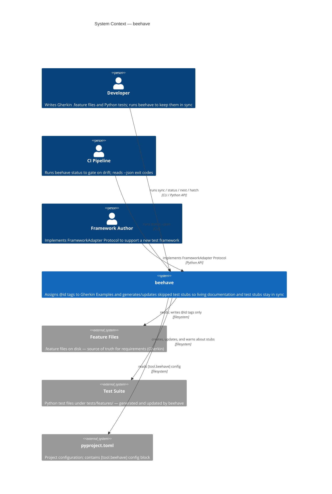
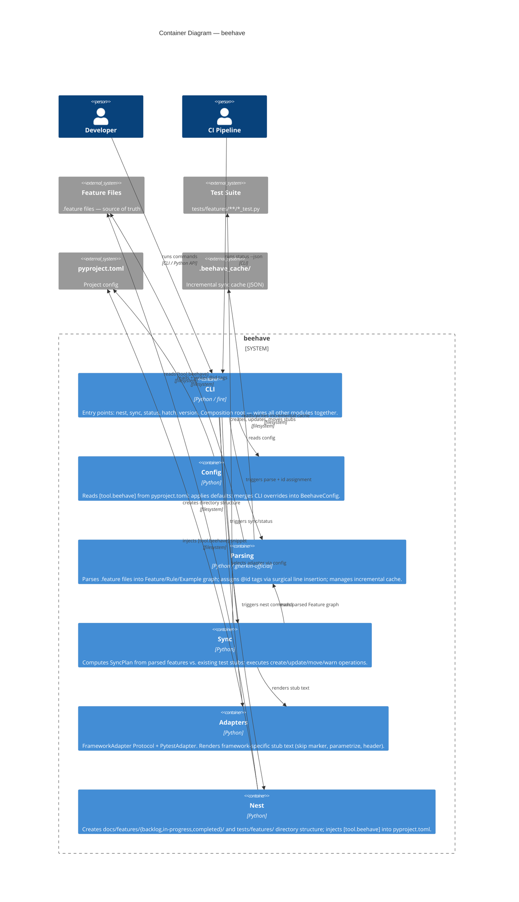

# System Overview: beehave

> Last updated: 2026-04-22 — architecture design session 1 (no features completed yet)

**Purpose:** beehave keeps Gherkin `.feature` files and Python test stubs in sync — assigning stable `@id` tags to Examples and generating/updating skipped test functions so living documentation and test stubs never diverge.

---

## Summary

beehave is a framework-agnostic CLI and Python library. Developers run `beehave sync` to reconcile their `.feature` files with their test suite: untagged Examples receive stable `@id` tags written back in-place using surgical line insertion, new stubs are created, changed stubs are updated, and orphaned stubs are flagged. A `beehave status` dry-run previews changes without writing anything. `beehave nest` bootstraps the canonical directory structure; `beehave hatch` generates demo content. The active test framework (default: pytest) is selected via `[tool.beehave]` in `pyproject.toml` or the `--framework` CLI flag.

---

## Actors

| Actor | Needs |
|-------|-------|
| Developer | Run `sync` to keep stubs current; run `status` in CI to gate on drift; run `nest` once per project |
| CI pipeline | `beehave status` exit codes (0 = in sync, 1 = drift); `--json` output for machine parsing |
| Framework author | `FrameworkAdapter` Protocol to supply stub conventions without importing from beehave |

---

## Structure

| Module | Responsibility |
|--------|----------------|
| `beehave/` | Package root; public Python API surface |
| `beehave/cli/` | Entry points: `nest`, `sync`, `status`, `hatch`, `version` (composition root; uses `fire`) |
| `beehave/config/` | Read `[tool.beehave]` from `pyproject.toml`; apply defaults; merge CLI overrides |
| `beehave/parsing/` | Parse `.feature` files via `gherkin-official`; assign `@id` tags (surgical insertion); derive slugs; manage incremental cache |
| `beehave/sync/` | Compute `SyncPlan`; execute create/update/move/warn operations on test stubs |
| `beehave/adapters/` | `FrameworkAdapter` Protocol + `PytestAdapter` concrete implementation |
| `beehave/nest/` | Create directory structure; inject `[tool.beehave]` into `pyproject.toml` |

---

## Key Decisions

- `.feature` files are the single source of truth; beehave only writes `@id` tags back to them using surgical line insertion — nothing else is touched
- Test stub identity is the `@id` embedded in the function name (`test_<feature_slug>_<id>`); this is the only stable link between a stub and its Example
- Framework adapters are selected by config/flag, not auto-detected; default is `pytest`; defined as `typing.Protocol` (zero import coupling for third-party adapters)
- Stage subfolders (`backlog/`, `in-progress/`, `completed/`) are transparent to sync — all map to the same `tests/features/<slug>/` directory
- Orphan stubs are warned about (or error, per `on_orphan` config) but never deleted automatically
- Duplicate `@id` values found in files is always a hard error — no safe resolution exists
- `@deprecated` cascade is absolute in v1: Feature/Rule `@deprecated` propagates to all child Examples with no per-Example override
- Cache is invisible to users; auto-rebuilt if missing, stale, or corrupt; full scan is the correctness baseline
- Absent `pyproject.toml` uses defaults (no error); malformed `pyproject.toml` is always a hard error
- Standard Python `logging` module; four levels (DEBUG/INFO/WARNING/ERROR); default WARNING; configurable via `log_level`

---

## Configuration Keys (`[tool.beehave]`)

| Key | Type | Default | Description |
|-----|------|---------|-------------|
| `framework` | string | `"pytest"` | Test framework adapter to use |
| `features_dir` | string | `"docs/features"` | Root directory for `.feature` files |
| `template_path` | string | `null` | Custom template folder (fully replaces built-in) |
| `log_level` | string | `"WARNING"` | Log level: DEBUG / INFO / WARNING / ERROR |
| `on_delete` | string | `"warn"` | Policy when a `.feature` file is deleted: `"warn"` or `"error"` |
| `on_orphan` | string | `"warn"` | Policy for orphan stubs (no matching `@id`): `"warn"` or `"error"` |

---

## External Dependencies

| Dependency | What it provides | Why not replaced |
|------------|------------------|-----------------|
| `gherkin-official` | Gherkin parser (AST from `.feature` files) | Official Cucumber parser; handles all Gherkin edge cases correctly |
| `fire` | CLI argument parsing and dispatch | Zero-boilerplate CLI from Python functions; matches beehave's simple command surface |

---

## Active Constraints

- No auto-detection of test framework — explicit config or flag required
- No watch mode, no pre-commit hooks, no auto-triggers — on-demand only
- Test bodies are never modified under any circumstance
- beehave never deletes files (stubs, feature files, or cache) automatically
- Config file location is always `pyproject.toml` in the current working directory; absent = use defaults
- v1 supports only the `pytest` adapter; `unittest` is parked for v2
- `@id` values are unique project-wide; collision on generation triggers silent retry; duplicate `@id` in files → hard error
- Malformed `@id` tags (empty value) are replaced in-place using surgical line scan
- Feature file rename is not detectable — old test directory becomes an orphan; developer migrates manually
- Scenario Outline column changes produce a warning only — parametrize decorator is never auto-modified
- Custom template folder is a full replacement for built-in templates (not a merge)
- Cache is optimisation-only at target scale (100–1,000 Examples); full-scan fallback is always correct

---

## Domain Model

### Bounded Contexts

| Context | Responsibility | Key Modules |
|---------|----------------|-------------|
| **Parsing** | Read `.feature` files; extract structure; assign `@id` tags; cache incremental state | `beehave/parsing/` |
| **Sync** | Reconcile parsed feature state with test stub state | `beehave/sync/` |
| **Adapters** | Render framework-specific stub text | `beehave/adapters/` |
| **Config** | Read `pyproject.toml`; merge CLI overrides; apply defaults | `beehave/config/` |
| **CLI** | Entry points: `nest`, `sync`, `status`, `hatch`, `version`; composition root | `beehave/cli/` |
| **Nest** | Create directory structure; inject `[tool.beehave]` into `pyproject.toml` | `beehave/nest/` |

### Entities

| Name | Type | Description | Bounded Context |
|------|------|-------------|-----------------|
| `FeatureFile` | Entity | A `.feature` file on disk; identified by its path; source of truth for requirements | Parsing |
| `Feature` | Value Object | Parsed representation of a Gherkin `Feature:` block; carries title, description, tags, and child Rules | Parsing |
| `Rule` | Value Object | A `Rule:` block inside a Feature; groups related Examples; maps to one test file | Parsing |
| `Example` | Value Object | A single `Example:` / `Scenario:` block; the atomic unit of acceptance criteria; carries tags, steps, and optional Outline table | Parsing |
| `ScenarioOutline` | Value Object | A parameterized Example with an `Examples:` table; extends `Example`; columns become parametrize args | Parsing |
| `ExampleId` | Value Object | An 8-char lowercase hex string (`@id:<value>`); stable identity linking an Example to its test stub | Parsing |
| `FeatureSlug` | Value Object | Snake-case string derived from a feature file's stem (stage folder ignored); used as test directory name and function name prefix | Parsing |
| `RuleSlug` | Value Object | Snake-case string derived from a `Rule:` title; used as the test file name | Parsing |
| `GherkinStep` | Value Object | A single Given/When/Then/And/But step line; carries keyword and text | Parsing |
| `CacheEntry` | Value Object | Per-file cache record: path, mtime, size, content hash | Parsing |
| `FeatureCache` | Entity | The full cache state; persisted as `.beehave_cache/features.json`; tracks all known FeatureFiles | Parsing |
| `TestStub` | Entity | A generated Python test function; identified by `@id` embedded in its name; carries docstring, skip marker, body | Sync |
| `TestFile` | Entity | A Python test file at `tests/features/<feature_slug>/<rule_slug>_test.py`; contains one or more TestStubs | Sync |
| `SyncPlan` | Value Object | Immutable description of all changes sync would make: stubs to create, update, move, warn about | Sync |
| `SyncResult` | Value Object | Outcome of executing a SyncPlan; lists created/updated/moved/warned items | Sync |
| `Orphan` | Value Object | A TestStub whose `@id` has no matching Example in any FeatureFile | Sync |
| `FrameworkAdapter` | Protocol | Interface all adapters must implement; supplies skip marker, deprecated marker, parametrize template, stub header | Adapters |
| `PytestAdapter` | Entity | Concrete adapter for pytest; implements `FrameworkAdapter` | Adapters |
| `StubTemplate` | Value Object | Rendered text template for a single stub function; produced by a FrameworkAdapter | Adapters |
| `BeehaveConfig` | Value Object | Resolved configuration: `framework`, `features_dir`, `template_path`, `log_level`, `on_delete`, `on_orphan`; defaults applied | Config |
| `RawConfig` | Value Object | Unvalidated key-value pairs read directly from `[tool.beehave]` in `pyproject.toml` | Config |
| `ColumnSet` | Value Object | Ordered set of column names from a Scenario Outline's `Examples:` table | Parsing |
| `DemoFeature` | Value Object | Bee-themed demo `.feature` file content generated by `hatch`; covers Feature/Rule/Example/Outline patterns | CLI |

### Verbs

| Name | Actor | Object | Description |
|------|-------|--------|-------------|
| `parse` | Parser | `FeatureFile` → `Feature` | Read a `.feature` file and return its structured representation |
| `assign_ids` | IdAssigner | `Feature` → `Feature` | Assign `ExampleId` to any Example lacking a valid one; write back in-place using surgical line insertion |
| `generate_id` | IdAssigner | — → `ExampleId` | Generate a unique 8-char lowercase hex id; retry on collision |
| `slugify` | — | `str` → `FeatureSlug` / `RuleSlug` | Convert a name to snake_case slug |
| `load_cache` | CacheManager | `Path` → `FeatureCache` | Load cache from disk; rebuild silently if missing/stale/corrupt |
| `save_cache` | CacheManager | `FeatureCache` → None | Persist cache to `.beehave_cache/features.json` |
| `is_stale` | CacheManager | `CacheEntry` × `FeatureFile` → `bool` | Check if a cached entry is out of date |
| `plan` | SyncEngine | `[Feature]` × `[TestFile]` → `SyncPlan` | Compute the diff between current feature state and test stub state |
| `execute` | SyncEngine | `SyncPlan` → `SyncResult` | Apply the plan: create/update/move stubs; emit warnings or errors per policy |
| `detect_orphans` | SyncEngine | `[TestStub]` × `[ExampleId]` → `[Orphan]` | Find stubs whose `@id` has no matching Example |
| `detect_misplaced` | SyncEngine | `[TestStub]` × `[Feature]` → `[(TestStub, Path)]` | Find stubs in wrong directory |
| `propagate_deprecated` | SyncEngine | `Feature` → `Feature` | Apply `@deprecated` cascade: Feature/Rule → all child Examples |
| `render_stub` | FrameworkAdapter | `Example` → `StubTemplate` | Render a test stub function text for the given Example |
| `render_parametrized_stub` | FrameworkAdapter | `ScenarioOutline` → `StubTemplate` | Render a parametrized stub for a Scenario Outline |
| `read_config` | ConfigReader | `Path` → `BeehaveConfig` | Read `pyproject.toml`, extract `[tool.beehave]`, apply defaults; absent file returns defaults |
| `merge_cli` | ConfigReader | `BeehaveConfig` × `CLIArgs` → `BeehaveConfig` | Override config values with CLI flag values |
| `nest` | NestRunner | `BeehaveConfig` → None | Create directory structure and inject `[tool.beehave]` into `pyproject.toml` |
| `check_nest` | NestRunner | `BeehaveConfig` → `bool` | Verify structure is complete without modifying anything (--check mode) |
| `hatch` | DemoGenerator | `Path` → None | Write bee-themed demo `.feature` files; skip if file already exists |

### Relationships

| Subject | Relation | Object | Cardinality | Notes |
|---------|----------|--------|-------------|-------|
| `FeatureFile` | contains | `Feature` | 1:1 | One Feature per file |
| `Feature` | contains | `Rule` | 1:N | One or more Rules per Feature |
| `Rule` | contains | `Example` | 1:N | One or more Examples per Rule |
| `Example` | has | `ExampleId` | 1:1 | Assigned by `assign_ids`; stable once set |
| `Example` | has | `GherkinStep` | 1:N | Ordered list of steps |
| `ScenarioOutline` | extends | `Example` | 1:1 | Adds `ColumnSet` and rows |
| `ScenarioOutline` | has | `ColumnSet` | 1:1 | Column names for parametrize |
| `FeatureFile` | maps-to | `FeatureSlug` | 1:1 | Derived from file stem; stage-folder-independent |
| `Rule` | maps-to | `RuleSlug` | 1:1 | Derived from Rule title |
| `Rule` | maps-to | `TestFile` | 1:1 | `tests/features/<feature_slug>/<rule_slug>_test.py` |
| `Example` | maps-to | `TestStub` | 1:1 | Identified by `@id` in function name |
| `TestStub` | lives-in | `TestFile` | N:1 | Multiple stubs per file |
| `FrameworkAdapter` | renders | `StubTemplate` | 1:N | One adapter, many stubs |
| `PytestAdapter` | implements | `FrameworkAdapter` | 1:1 | v1 only built-in |
| `BeehaveConfig` | selects | `FrameworkAdapter` | 1:1 | Via `framework` key |
| `BeehaveConfig` | points-to | `StubTemplate` | 0:1 | Via `template_path`; None = use adapter default |
| `SyncPlan` | references | `FeatureFile` | 1:N | Plan covers all changed files |
| `SyncPlan` | references | `TestFile` | 1:N | Plan covers all affected test files |
| `FeatureCache` | contains | `CacheEntry` | 1:N | One entry per known FeatureFile |
| `CacheEntry` | tracks | `FeatureFile` | 1:1 | Path + mtime + hash |
| `Orphan` | wraps | `TestStub` | 1:1 | Orphan is a classification of a stub |
| `Feature` | may-carry | `@deprecated` | 1:0..1 | Cascades to all child Rules and Examples |
| `Rule` | may-carry | `@deprecated` | 1:0..1 | Cascades to all child Examples |
| `Example` | may-carry | `@deprecated` | 1:0..1 | Direct; no override of parent in v1 |

### Module Dependency Graph

```
CLI  ──► Config ──► (pyproject.toml)
 │
 ├──► Nest ──► (filesystem)
 │
 ├──► Parsing ──► (filesystem / gherkin-official)
 │       └──► (cache: .beehave_cache/features.json)
 │
 ├──► Sync ──► Parsing
 │      └──► Adapters
 │
 └──► Adapters ──► (templates)
```

**Dependency rules (enforced):**
- `Parsing` has no dependency on `Sync`, `Adapters`, `CLI`, or `Nest`
- `Adapters` has no dependency on `Parsing`, `Sync`, `CLI`, or `Nest`
- `Config` has no dependency on `Parsing`, `Sync`, `Adapters`, or `Nest`
- `Sync` depends on `Parsing` and `Adapters`
- `CLI` depends on all other contexts; it is the composition root
- `Nest` depends only on `Config`

---

## Context



---

## Container



---

## ADRs

See `docs/adr/` for the full decision record. Each ADR contains a `## Context` section with the Q&A that produced the decision.

| ADR | Decision |
|-----|----------|
| `ADR-2026-04-22-feature-file-write-policy` | `.feature` files are write-once for `@id` tags only; surgical line insertion |
| `ADR-2026-04-22-adapter-protocol` | `FrameworkAdapter` as a structural `typing.Protocol` (not ABC) |
| `ADR-2026-04-22-id-stability` | `@id` assignment, collision policy, duplicate = hard error |
| `ADR-2026-04-22-error-handling-policy` | Error vs. warn policy per condition; `on_delete` and `on_orphan` config keys |
| `ADR-2026-04-22-slug-derivation` | Slug from file stem only; stage-folder-independent; rename = orphan |
| `ADR-2026-04-22-module-structure` | 6 submodules: cli, config, parsing, sync, adapters, nest |
| `ADR-2026-04-22-performance-targets` | Target scale medium (100–1k Examples); cache is optimisation not load-bearing |
| `ADR-2026-04-22-backwards-compatibility` | Best-effort warn-before-remove; no hard semver guarantee |
| `ADR-2026-04-22-logging-observability` | Standard Python logging; 4 levels; `log_level` config key + `--log-level` flag |

---

## Completed Features

*(none — implementation not yet started)*
